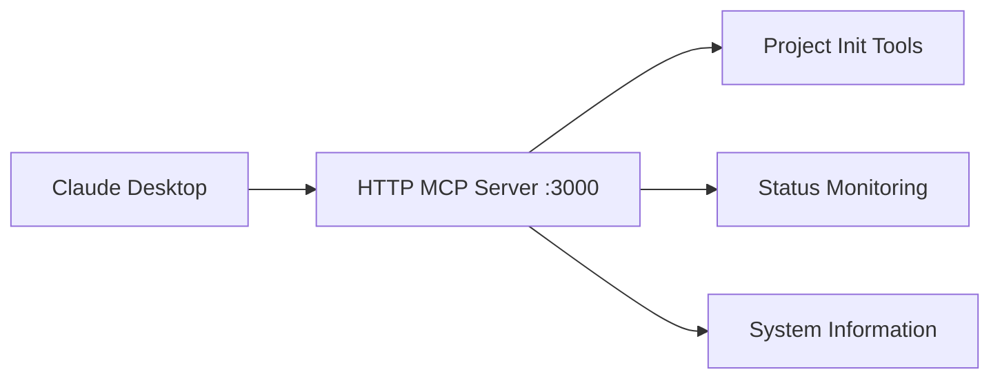
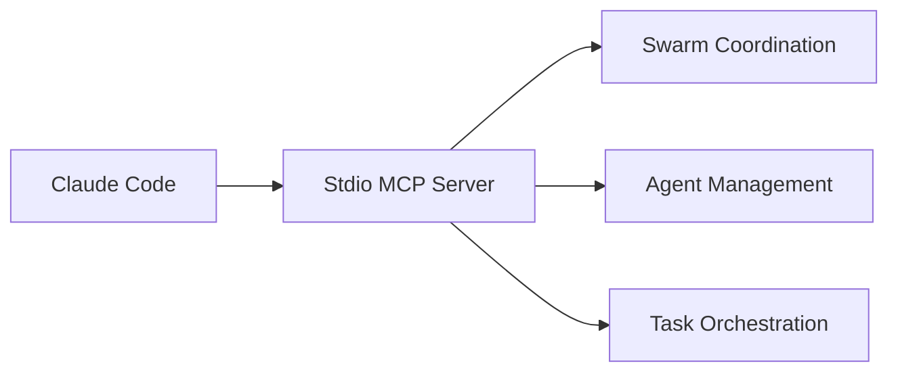

# Claude Zen Project

This project is configured for Claude Code integration.

## ⚠️ CRITICAL: DO NOT MODIFY .claude/ DIRECTORY

**🚨 NEVER TOUCH `.claude/` DIRECTORY** - This is for **THIS PROJECT'S DEVELOPMENT ONLY**:
- `.claude/settings.json` = Our development hooks and configuration
- `.claude/commands/` = Our development command documentation  
- `.claude/cache/` = Our development session data

**✅ MODIFY TEMPLATE INSTEAD**: 
- `templates/claude-zen/` = Template files that get copied to other projects
- `templates/claude-zen/settings.json` = Template hooks for new projects

**The Rule**: 
- Changes to `.claude/` = Affects this development project only
- Changes to `templates/claude-zen/` = Affects all new projects created with `claude-zen init`

## Getting Started

Run `claude-zen --help` to see available commands.

## Commands

- `claude-zen init` - Initialize project with Claude Code integration
- `claude-zen status` - Show project status  
- `claude-zen help` - Show help

## Development

This project uses:
- **Template system** for `claude-zen init` functionality
- **MCP integration** with ruv-swarm-zen for coordination
- **Plugin architecture** for extensible functionality

## 🔗 MCP Architecture - Dual System Integration

Claude-Zen implements a sophisticated dual MCP (Model Context Protocol) architecture to support both Claude Desktop integration and swarm coordination:

### 🏗️ **Dual MCP System Overview**

**Claude-Zen operates two distinct MCP servers:**

1. **HTTP MCP Server** (`src/interfaces/mcp/`) - **Port 3000**
   - **Purpose**: Claude Desktop integration via HTTP-based MCP protocol
   - **Protocol**: MCP over HTTP with JSON-RPC 2.0
   - **Target**: Human-facing Claude Desktop application
   - **Tools**: Core project management, system info, project initialization

2. **Stdio MCP Server** (`src/swarm-zen/`) - **Stdio Protocol**
   - **Purpose**: Swarm coordination and agent orchestration
   - **Protocol**: MCP over stdin/stdout for Claude Code integration
   - **Target**: Automated swarm coordination and AI agent management
   - **Tools**: Swarm initialization, agent spawning, task orchestration

### 🚀 **HTTP MCP Server Setup (Claude Desktop)**

For human interaction via Claude Desktop:

```bash
# 1. Start the HTTP MCP server
npx claude-zen mcp start

# 2. Add to Claude Desktop MCP configuration:
# File: ~/Library/Application Support/Claude/claude_desktop_config.json (macOS)
# File: %APPDATA%/Claude/claude_desktop_config.json (Windows)
# File: ~/.config/claude/claude_desktop_config.json (Linux)
{
  "mcpServers": {
    "claude-zen": {
      "command": "npx",
      "args": ["claude-zen", "mcp", "start"]
    }
  }
}
```

**Available HTTP MCP Tools:**
- `system_info` - Get Claude-Zen system status and metrics
- `project_init` - Initialize new projects with templates
- `project_status` - Comprehensive project health and status

**HTTP Endpoints:**
- `http://localhost:3000/health` - Server health check
- `http://localhost:3000/capabilities` - MCP capabilities
- `http://localhost:3000/mcp` - Main MCP JSON-RPC endpoint
- `http://localhost:3000/tools` - List all available tools
- `http://localhost:3000/tools/:toolName` - Direct tool execution

### 🐝 **Stdio MCP Server Setup (Swarm Coordination)**

For automated swarm coordination with Claude Code:

```bash
# Add ruv-swarm-zen MCP server to Claude Code
claude mcp add ruv-swarm-zen npx claude-zen swarm mcp start
```

**Available Swarm MCP Tools:**
- `mcp__ruv-swarm-zen__swarm_init` - Initialize coordination topology
- `mcp__ruv-swarm-zen__agent_spawn` - Create specialized agents
- `mcp__ruv-swarm-zen__task_orchestrate` - Coordinate complex tasks
- `mcp__ruv-swarm-zen__swarm_status` - Monitor coordination status
- `mcp__ruv-swarm-zen__memory_usage` - Manage persistent memory

### 🔄 **MCP Integration Workflow**

#### **Phase 1: Human Planning (HTTP MCP)**


1. **Project Planning**: Use Claude Desktop with HTTP MCP for high-level project planning
2. **Template Selection**: Initialize projects with appropriate templates
3. **Status Monitoring**: Track project health and metrics

#### **Phase 2: AI Execution (Stdio MCP)**


1. **Swarm Initialization**: Claude Code uses stdio MCP for swarm setup
2. **Agent Coordination**: Spawn and manage specialized AI agents
3. **Task Execution**: Orchestrate complex multi-agent workflows

### 📋 **MCP Server Architecture**

#### **HTTP MCP Server Components:**

```
src/interfaces/mcp/
├── http-mcp-server.ts     # Main HTTP server with Express.js
├── start-server.ts        # Startup script with CLI args
├── request-handler.ts     # MCP protocol request routing
├── tool-registry.ts       # Tool registration and execution
└── simple-logger.ts       # Logging utilities
```

**Key Features:**
- **Express.js HTTP Server**: RESTful endpoints + JSON-RPC MCP protocol
- **CORS Support**: Cross-origin requests for web integration
- **Tool Registry**: Dynamic tool registration with schema validation
- **Request Validation**: JSON-RPC 2.0 compliance and parameter validation
- **Performance Metrics**: Tool execution statistics and monitoring
- **Graceful Shutdown**: Clean server termination with signal handling

#### **Stdio MCP Server Components:**

```
src/swarm-zen/
├── mcp-server.ts          # Stdio MCP protocol handler
├── tools/                 # Swarm coordination tools
├── agents/                # Agent management system
└── coordination/          # Multi-agent orchestration
```

### 🛠️ **Development Commands**

#### **HTTP MCP Server Operations:**
```bash
# Start HTTP MCP server
npx claude-zen mcp start

# Start with custom configuration
npx claude-zen mcp start --port 3001 --host 0.0.0.0

# Test server health
curl http://localhost:3000/health

# List available tools
curl http://localhost:3000/tools

# Execute tool directly
curl -X POST http://localhost:3000/tools/system_info \
  -H "Content-Type: application/json" \
  -d '{"detailed": true}'
```

#### **Stdio MCP Server Operations:**
```bash
# Test swarm coordination via Claude Code
claude code "Initialize a mesh topology swarm with 5 agents"

# Verify MCP integration
claude mcp list

# Check swarm status
npx claude-zen swarm status
```

### 🔧 **Configuration Options**

#### **HTTP MCP Server Config:**
```typescript
interface MCPServerConfig {
  port: number;           // Default: 3000
  host: string;          // Default: localhost
  cors: boolean;         // Default: true
  timeout: number;       // Default: 30000ms
  maxRequestSize: string; // Default: '10mb'
  logLevel: 'debug' | 'info' | 'warn' | 'error';
}
```

**Environment Variables:**
- `MCP_PORT` - Server port (default: 3000)
- `MCP_HOST` - Server host (default: localhost)
- `MCP_LOG_LEVEL` - Logging level (default: info)
- `MCP_TIMEOUT` - Request timeout (default: 30000)

#### **Stdio MCP Server Config:**
```typescript
interface SwarmMCPConfig {
  topology: 'mesh' | 'hierarchical' | 'ring' | 'star';
  maxAgents: number;
  memoryPersistence: boolean;
  coordinationStrategy: 'parallel' | 'sequential' | 'adaptive';
}
```

### 🧪 **Testing MCP Integration**

#### **HTTP MCP Server Tests:**
```bash
# Unit tests for HTTP server
npm test src/interfaces/mcp/

# Integration tests with Claude Desktop
npm run test:mcp-integration

# Load testing
npm run test:mcp-load
```

#### **Stdio MCP Server Tests:**
```bash
# Swarm coordination tests
npm test src/swarm-zen/

# Claude Code integration tests  
npm run test:swarm-integration

# Multi-agent workflow tests
npm run test:coordination
```

### 🔍 **Monitoring and Debugging**

#### **HTTP MCP Server Monitoring:**
```bash
# Server logs
tail -f logs/mcp-server.log

# Performance metrics
curl http://localhost:3000/capabilities

# Tool execution stats
curl http://localhost:3000/tools | jq '.tools[] | {name, stats}'
```

#### **Stdio MCP Server Monitoring:**
```bash
# Swarm status
npx claude-zen swarm status

# Agent activity
npx claude-zen agents list

# Memory usage
npx claude-zen memory status
```

### 🚨 **Troubleshooting**

#### **Common HTTP MCP Issues:**
1. **Port 3000 in use**: `npx claude-zen mcp start --port 3001`
2. **CORS errors**: Check `cors: true` in server config
3. **Tool not found**: Verify tool registration in `tool-registry.ts`
4. **Timeout errors**: Increase `MCP_TIMEOUT` environment variable

#### **Common Stdio MCP Issues:**
1. **Swarm not initializing**: Check `claude mcp list` for proper registration
2. **Agent spawn failures**: Verify memory and resource limits
3. **Coordination timeouts**: Adjust `coordinationStrategy` in config
4. **Memory persistence**: Ensure write permissions for cache directory

### 🎯 **Best Practices**

1. **HTTP MCP Usage:**
   - Use for human-facing project management
   - Implement proper error handling in tools
   - Monitor performance metrics regularly
   - Use HTTPS in production environments

2. **Stdio MCP Usage:**
   - Batch operations for efficiency
   - Use parallel execution for complex tasks
   - Maintain memory state across sessions
   - Monitor swarm health continuously

3. **Integration Patterns:**
   - Start with HTTP MCP for planning
   - Transition to Stdio MCP for execution
   - Use memory persistence for continuity
   - Implement proper logging for debugging

### 🔗 **Integration Examples**

#### **Full Workflow Example:**
```bash
# 1. Human planning via Claude Desktop (HTTP MCP)
# Use Claude Desktop to initialize project and plan architecture

# 2. Automated execution via Claude Code (Stdio MCP)  
claude code "Initialize swarm with 5 agents and implement the planned architecture"

# 3. Monitor progress via HTTP MCP
curl http://localhost:3000/tools/project_status | jq '.status'

# 4. Continue coordination via Stdio MCP
claude code "Deploy the implemented architecture using swarm coordination"
```

This dual MCP architecture enables seamless integration between human planning (Claude Desktop) and AI execution (Claude Code), providing the best of both worlds for complex development workflows.

## 🧪 Testing Strategy for Claude-Zen

### **Hybrid TDD Approach: 70% London + 30% Classical**

Claude-Zen uses a hybrid testing approach optimized for distributed AI systems:

#### **Testing Philosophy**
- **TDD London (70%)**: For distributed components, protocols, and integration boundaries
- **Classical TDD (30%)**: For neural algorithms, WASM computations, and mathematical operations
- **Real-time Hybrid**: For WebSocket and swarm coordination testing

#### **Component-Based Testing Strategy**

```typescript
// TDD London (Mockist) - Use for these components:
const londonComponents = [
  'MCP Protocol Compliance',
  'WebSocket Real-time Communication', 
  'Swarm Coordination & Agent Messaging',
  'Inter-service Integration Boundaries',
  'CLI Command Processing',
  'Memory Store Operations',
  'External API Integration'
];

// Classical TDD (Detroit) - Use for these components:
const classicalComponents = [
  'Neural Network Algorithms (ruv-FANN)',
  'WASM Computation Kernels', 
  'Mathematical Operations & Transformations',
  'Data Structure Manipulations',
  'Pure Function Logic',
  'Performance-Critical Code Paths'
];
```

#### **Testing Structure**

```
src/__tests__/
├── unit/                    # 70% of tests
│   ├── london/             # Mockist tests (interactions)
│   │   ├── mcp-protocol/
│   │   ├── swarm-coordination/
│   │   └── integration-boundaries/
│   └── classical/          # Detroit tests (results)
│       ├── neural-algorithms/
│       ├── wasm-computations/
│       └── mathematical-operations/
├── integration/            # 25% of tests
│   ├── component-boundaries/
│   ├── protocol-compliance/
│   └── wasm-js-bridge/
└── e2e/                   # 5% of tests
    ├── full-system-workflows/
    └── performance-scenarios/
```

#### **TDD London Examples (Mockist)**

```typescript
// ✅ Use for MCP protocol, swarm coordination, CLI commands
describe('MCP Protocol Handler', () => {
  it('should validate and route tool calls correctly', async () => {
    // Inline mocks following TDD London
    const mockValidator = { validate: jest.fn().mockReturnValue(true) };
    const mockExecutor = { execute: jest.fn().mockResolvedValue({ success: true }) };
    
    const handler = new MCPHandler(mockValidator, mockExecutor);
    await handler.handleToolCall('swarm_init', { topology: 'mesh' });
    
    // Verify interactions, not state
    expect(mockValidator.validate).toHaveBeenCalledWith('swarm_init', { topology: 'mesh' });
    expect(mockExecutor.execute).toHaveBeenCalledWith('swarm_init', { topology: 'mesh' });
  });
});
```

#### **Classical TDD Examples (Detroit)**

```typescript
// ✅ Use for neural networks, WASM math, algorithms
describe('Neural Network Training', () => {
  it('should converge on XOR problem', () => {
    const network = new NeuralNetwork([2, 4, 1]);
    const xorData = [
      { input: [0, 0], output: [0] },
      { input: [0, 1], output: [1] },
      { input: [1, 0], output: [1] },
      { input: [1, 1], output: [0] }
    ];
    
    const result = network.train(xorData, { epochs: 1000 });
    
    // Test actual results, not mocks
    expect(network.predict([0, 0])[0]).toBeCloseTo(0, 1);
    expect(network.predict([1, 1])[0]).toBeCloseTo(0, 1);
    expect(result.finalError).toBeLessThan(0.01);
  });
});
```

#### **Hybrid Testing for Real-time Systems**

```typescript
// 🔄 Combine both approaches for WebSocket/real-time
describe('Swarm Real-time Coordination', () => {
  it('should coordinate agents with <100ms latency', async () => {
    // Mock the protocol (London)
    const mockProtocol = { encode: jest.fn(), decode: jest.fn() };
    
    // Test real performance (Classical)
    const coordinator = new SwarmCoordinator(mockProtocol);
    const startTime = Date.now();
    
    await coordinator.broadcastMessage({ type: 'sync' });
    
    expect(Date.now() - startTime).toBeLessThan(100);
    expect(mockProtocol.encode).toHaveBeenCalled();
  });
});
```

#### **Best Practices**

1. **Mock Boundaries, Not Implementation**
   - Mock at integration points (APIs, protocols, I/O)
   - Don't mock internal logic or algorithms

2. **Test Behavior, Not State**
   - London: Verify method calls and interactions
   - Classical: Verify computation results and transformations

3. **Performance Testing**
   - Use Classical TDD for benchmarking
   - Test actual execution times and throughput

4. **WASM Testing Strategy**
   ```typescript
   // Mock the loading, test the computation
   const mockLoader = createMockWasmLoader();
   const realComputation = await wasmModule.compute(data);
   expect(realComputation.result).toBeCloseTo(expected, 0.001);
   ```

#### **When to Use Each Approach**

| Component Type | Testing Approach | Reason |
|---------------|------------------|---------|
| MCP Protocol | TDD London | Test message handling and routing |
| Neural Networks | Classical TDD | Verify mathematical correctness |
| WebSocket | Hybrid | Mock protocol, test latency |
| CLI Commands | TDD London | Test command parsing and dispatch |
| WASM Functions | Classical TDD | Verify computation accuracy |
| Swarm Coordination | TDD London | Test agent interactions |
| Data Transformations | Classical TDD | Verify output correctness |

#### **Migration from Pure London to Hybrid**

1. Keep existing London tests for distributed components
2. Add Classical tests for computational components
3. Use test helpers from `/test/helpers/` for consistency
4. Follow the 70/30 split guideline

#### **Test Quality Metrics**

- **Unit Test Coverage**: Minimum 80% (London + Classical)
- **Integration Coverage**: 100% for critical paths
- **Performance Benchmarks**: Must meet SLA targets
- **Mutation Testing**: Consider for critical algorithms

This hybrid approach gives Claude-Zen the best of both worlds: clean interaction testing for distributed components and rigorous result verification for computational cores.

## 📋 Document-Driven Development System

Claude-Zen implements a sophisticated document-driven development workflow that transforms high-level vision documents into executable code through structured phases:

### 🌟 **Workflow Phases**

**Vision → ADRs → PRDs → Epics → Features → Tasks → Code**

1. **Vision Documents** (`docs/vision/`) - High-level project vision and goals
2. **Architecture Decision Records** (`docs/adrs/`) - Cross-cutting technical decisions
3. **Product Requirements Documents** (`docs/prds/`) - Detailed feature specifications  
4. **Epics** (`docs/epics/`) - Large feature groupings and user stories
5. **Features** (`docs/features/`) - Specific implementable features
6. **Tasks** (`docs/tasks/`) - Granular development tasks
7. **Code** (`src/`) - Final implementation

### 🏗️ **Document Processing System**

```typescript
// Core document-driven system
export class DocumentDrivenSystem extends EventEmitter {
  async processVisionaryDocument(workspaceId: string, docPath: string): Promise<void> {
    const docType = this.getDocumentType(docPath);
    
    switch (docType) {
      case 'vision': await this.processVisionDocument(workspaceId, doc); break;
      case 'adr': await this.processADR(workspaceId, doc); break;
      case 'prd': await this.processPRD(workspaceId, doc); break;
      case 'epic': await this.processEpic(workspaceId, doc); break;
      case 'feature': await this.processFeature(workspaceId, doc); break;
    }
  }
}
```

### 📂 **Workspace Structure**

```bash
# Created by: claude-zen workspace init
project-name/
├── docs/
│   ├── vision/           # High-level vision documents
│   ├── adrs/            # Architecture Decision Records
│   ├── prds/            # Product Requirements Documents  
│   ├── epics/           # Epic user stories
│   ├── features/        # Feature specifications
│   └── tasks/           # Development tasks
├── src/                 # Implementation code
├── tests/               # Test suites
└── .claude/
    ├── settings.json    # Claude Code integration
    ├── commands/        # Custom development commands
    └── cache/           # Session persistence
```

### 🛠️ **Workspace Commands**

```bash
# Initialize document-driven workspace
claude-zen workspace init <project-name> [--template=advanced]

# Process vision document into ADRs/PRDs
claude-zen workspace process docs/vision/product-vision.md

# Generate epic from PRD
claude-zen workspace generate epic --from=docs/prds/user-auth.md

# Create feature tasks from epic
claude-zen workspace breakdown docs/epics/authentication-epic.md

# Monitor workspace status
claude-zen workspace status

# Generate code from feature specifications
claude-zen workspace implement docs/features/jwt-authentication.md
```

### 🔄 **Integration with MCP Systems**

The document-driven system integrates seamlessly with both MCP servers:

#### **HTTP MCP Integration (Claude Desktop):**
- Human planning and document creation via Claude Desktop
- Visual workspace monitoring and progress tracking
- Template selection and project initialization

#### **Stdio MCP Integration (Claude Code):**
- Automated document processing and code generation
- Swarm coordination for complex multi-file implementations
- Continuous integration with development workflow

### 🎯 **Maestro Integration**

Claude-Zen incorporates Maestro-style structured specifications for enhanced clarity:

```markdown
# Feature: JWT Authentication (Maestro Format)

## Context
- User authentication system needs secure token-based auth
- Must integrate with existing user management
- Requires session persistence and refresh capabilities

## Success Criteria
- [ ] JWT tokens generated on successful login
- [ ] Token validation middleware implemented
- [ ] Refresh token rotation system active
- [ ] Session management with secure storage

## Implementation Plan
1. JWT library integration
2. Authentication middleware
3. Token refresh endpoints
4. Session storage system
```

### 🧠 **AI-Driven Document Processing**

When documents are processed, the system uses swarm coordination to:

1. **Analyze Requirements**: Parse vision documents for key requirements
2. **Generate ADRs**: Create architecture decisions based on technical constraints
3. **Decompose Features**: Break down PRDs into implementable features
4. **Plan Implementation**: Generate task lists with dependencies
5. **Code Generation**: Implement features using swarm coordination

### 📊 **Progress Tracking**

```bash
# View document processing pipeline
claude-zen workspace pipeline

# Track feature implementation status  
claude-zen workspace metrics

# Generate progress reports
claude-zen workspace report --format=markdown
```

## 🔗 **Complete Integration Workflow**

### **Phase 1: Human Vision (Claude Desktop + HTTP MCP)**
1. Create vision document in Claude Desktop
2. Use HTTP MCP tools for project initialization
3. Plan architecture and select templates

### **Phase 2: AI Processing (Claude Code + Stdio MCP)**  
1. Process vision → ADRs → PRDs using swarm coordination
2. Generate epics and features automatically
3. Create task breakdowns with dependencies

### **Phase 3: Implementation (Hybrid Approach)**
1. Use swarms for complex multi-file implementations
2. Apply hybrid TDD testing strategy (70% London + 30% Classical)
3. Continuous integration with document updates

### **Phase 4: Monitoring (HTTP MCP)**
1. Track implementation progress via Claude Desktop
2. Monitor system health and performance
3. Generate reports and documentation

## 📚 **Support and Documentation**

- **Main Repository**: https://github.com/ruvnet/claude-code-flow
- **Issue Tracking**: https://github.com/ruvnet/claude-code-flow/issues
- **Documentation**: https://github.com/ruvnet/claude-code-flow/wiki
- **Examples**: https://github.com/ruvnet/claude-code-flow/tree/main/examples

## 🎯 **Quick Start Guide**

```bash
# 1. Initialize document-driven project
claude-zen workspace init my-project --template=advanced

# 2. Start HTTP MCP server for Claude Desktop
claude-zen mcp start

# 3. Add stdio MCP for Claude Code
claude mcp add claude-zen-swarm npx claude-zen swarm mcp start

# 4. Create vision document and start development
cd my-project
# Use Claude Desktop to create docs/vision/product-vision.md
# Use Claude Code to process and implement
```

This comprehensive system bridges the gap between high-level human planning and detailed AI-driven implementation, providing a structured path from vision to code.