/**
 * @fileoverview Claude Code Configuration for claude-code-zen Swarm System
 * 
 * Comprehensive configuration document for Claude Code instances working with
 * claude-code-zen's TypeScript/Rust swarm system. This document defines the separation 
 * of responsibilities, coordination protocols, and best practices for efficient parallel execution.
 * 
 * Key Features:
 * - TypeScript/Rust swarm coordination system
 * - Advanced intelligence systems (agent learning, prediction, health monitoring)
 * - SPARC methodology integration for systematic development
 * - Comprehensive neural coordination with DSPy integration
 * - High-performance parallel execution patterns
 * - Multi-database storage (SQLite, LanceDB, Kuzu graph)
 * - RESTful API with OpenAPI 3.0 documentation
 * - Svelte web dashboard interface
 * 
 * @author Claude Code Zen Team
 * @since 1.0.0-alpha.44
 * @version 2.1.0
 * 
 * @see {@link https://github.com/zen-neural/claude-code-zen} claude-code-zen Documentation
 * @see {@link https://docs.anthropic.com/en/docs/claude-code} Claude Code Documentation
 * 
 * @requires claude-code-zen - TypeScript/Rust swarm coordination system
 * @requires @anthropic/claude-code - Native Claude Code CLI tools
 * 
 * @example
 * ```bash
 * # claude-code-zen swarm system
 * # Backend: TypeScript/Rust API service
 * # Frontend: Svelte web interface
 * # Integration: REST API with OpenAPI 3.0
 * ```
 */

# Claude Code Configuration for claude-code-zen Swarm System

## 🎯 IMPORTANT: Separation of Responsibilities

### Claude Code Handles:
- ✅ **ALL file operations** (Read, Write, Edit, MultiEdit)
- ✅ **ALL code generation** and development tasks
- ✅ **ALL bash commands** and system operations
- ✅ **ALL actual implementation** work
- ✅ **Project navigation** and code analysis

### claude-code-zen Swarm System Handles:
- 🧠 **Intelligent Coordination** - Advanced agent learning and adaptation
- 💾 **Persistent Memory** - Multi-database storage (SQLite, LanceDB, Kuzu)
- 🤖 **Neural Intelligence** - DSPy integration with cognitive patterns
- 📊 **Performance Analytics** - Agent health monitoring and prediction
- 🐝 **Swarm Orchestration** - Internal coordination via events and direct calls
- 🏗️ **SPARC Integration** - Systematic architecture development
- ⚡ **Event System** - Comprehensive type-safe event-driven coordination
- 🌐 **Web API** - RESTful API with OpenAPI 3.0 (web interface ONLY)
- 🎨 **Svelte Frontend** - Web-based dashboard and interface

### ⚠️ Key Principle:
**claude-code-zen provides a complete swarm coordination system.** It uses **internal event-driven coordination** for agent communication and **REST API only for web interface**. The coordination system includes development system components: queens, commanders, cubes, and matrons working together through events and direct method calls.

## 📦 **EXTRACTED LIBRARIES STATUS**

### **Current Library Structure: MIGRATION COMPLETED**

✅ **MONOREPO MIGRATION COMPLETE**: All libraries successfully migrated to **`/packages/`** structure with **`@claude-zen`** namespace and **pnpm workspace** management.

#### **✅ Complete Package Structure (22 Total)**

**🔓 Public Packages (15 total) - Publishable to npm:**
1. **`@claude-zen/foundation`** - Common utilities, logging, DI container, LLM provider interfaces
2. **`@claude-zen/event-system`** - Comprehensive type-safe event system with domain validation  
3. **`@claude-zen/brain`** - Neural brain coordination with Rust/WASM integration and FANN neural networks
4. **`@claude-zen/ai-safety`** - AI safety protocols, deception detection, and safety monitoring
5. **`@claude-zen/knowledge`** - Knowledge management and semantic understanding (**private: false**)
6. **`@claude-zen/agui`** - Advanced GUI and task approval workflows (**private: false**) ✅ **INTEGRATED INTO SVELTE**
7. **`@claude-zen/teamwork`** - Multi-agent teamwork coordination and collaboration
8. **`@claude-zen/workflows`** - Workflow orchestration and process management (**private: false**)
9. **`@claude-zen/agent-manager`** - Agent lifecycle management
10. **`@claude-zen/coordination-core`** - Core coordination logic
11. **`@claude-zen/sparc`** - SPARC methodology implementation
12. **`@claude-zen/multi-level-orchestration`** - Portfolio→Program→Swarm orchestration
13. **`@claude-zen/safe-framework`** - SAFe enterprise framework
14. **`@claude-zen/memory-orchestration`** - Memory coordination
15. **`@claude-zen/llm-routing`** - LLM provider routing

**🔒 Private Packages (7 total) - Internal use only:**
16. **`@claude-zen/database`** - Multi-database abstraction (**private: true**)
17. **`@claude-zen/chaos-engineering`** - System resilience testing (**private: true**)
18. **`@claude-zen/dspy`** - DSPy Stanford implementation (**private: true**)
19. **`@claude-zen/load-balancing`** - Resource optimization (**private: true**)
20. **`@claude-zen/agent-monitoring`** - Agent health tracking (**private: true**)
21. **`@claude-zen/fact-system`** - Fact-based reasoning + Rust (**private: true**)
22. **`@claude-zen/neural-ml`** - ML integration & patterns (**private: true**)

### **📊 Current Monorepo Structure: ACTIVE**

```mermaid
graph TB
    subgraph "Claude Code Zen Monorepo Architecture"
        subgraph "Applications (Private)"
            SERVER["`🚀 **claude-code-zen-server**
            Main API Service
            *Port 3000*
            **private: true**`"]
            DASHBOARD["`🎨 **web-dashboard** 
            Svelte Frontend
            *Port 3002* 
            **private: true**
            ✅ **AGUI Integrated**`"]
        end
        
        subgraph "Public Packages (Publishable)"
            AGUI["`🎯 **@claude-zen/agui**
            Human-in-Loop Interface
            **private: false**`"]
            WORKFLOWS["`⚡ **@claude-zen/workflows**
            Process Orchestration  
            **private: false**`"]
            KNOWLEDGE["`🧠 **@claude-zen/knowledge**
            Knowledge Management
            **private: false**`"]
            FOUNDATION["`🔧 **@claude-zen/foundation**
            Core Utilities & DI
            **public** (default)`"]
            EVENT_SYSTEM["`📡 **@claude-zen/event-system**
            Type-Safe Events
            **public** (default)`"]
            BRAIN["`🧮 **@claude-zen/brain** 
            Neural Coordination + Rust
            **public** (default)`"]
            AI_SAFETY["`🛡️ **@claude-zen/ai-safety**
            Safety Protocols
            **public** (default)`"]
            TEAMWORK["`🤝 **@claude-zen/teamwork**
            Multi-Agent Collaboration
            **public** (default)`"]
            AGENT_MANAGER["`👥 **@claude-zen/agent-manager**
            Agent Lifecycle Management
            **public** (default)`"]
            COORDINATION_CORE["`🎯 **@claude-zen/coordination-core**
            Core Coordination Logic
            **public** (default)`"]
            SPARC["`📋 **@claude-zen/sparc**
            SPARC Methodology
            **public** (default)`"]
            MULTI_LEVEL["`🏗️ **@claude-zen/multi-level-orchestration**
            Portfolio→Program→Swarm
            **public** (default)`"]
            SAFE_FRAMEWORK["`🏢 **@claude-zen/safe-framework**
            SAFe Enterprise Framework
            **public** (default)`"]
            MEMORY_ORCH["`💾 **@claude-zen/memory-orchestration**
            Memory Coordination
            **public** (default)`"]
            LLM_ROUTING["`🤖 **@claude-zen/llm-routing**
            LLM Provider Routing
            **public** (default)`"]
        end
        
        subgraph "Private Packages (Internal Use)"
            DATABASE["`💾 **@claude-zen/database**
            Multi-DB Abstraction
            **private: true**`"]
            CHAOS["`🔥 **@claude-zen/chaos-engineering**
            Resilience Testing
            **private: true**`"]
            DSPY["`🎓 **@claude-zen/dspy**
            DSPy Stanford Integration
            **private: true**`"]
            LOAD_BALANCING["`⚖️ **@claude-zen/load-balancing**
            Resource Optimization
            **private: true**`"]
            AGENT_MONITORING["`📊 **@claude-zen/agent-monitoring**
            Agent Health Tracking
            **private: true**`"]
            FACT_SYSTEM["`📚 **@claude-zen/fact-system**
            Fact-Based Reasoning + Rust
            **private: true**`"]
            NEURAL_ML["`🧠 **@claude-zen/neural-ml**
            ML Integration & Patterns
            **private: true**`"]
        end
    end
    
    %% Dependencies
    SERVER --> FOUNDATION
    SERVER --> EVENT_SYSTEM
    SERVER --> COORDINATION_CORE
    SERVER --> SPARC
    SERVER --> MULTI_LEVEL
    SERVER --> DATABASE
    
    DASHBOARD --> AGUI
    DASHBOARD -.-> SERVER
    
    AGUI --> FOUNDATION
    WORKFLOWS --> EVENT_SYSTEM
    KNOWLEDGE --> DATABASE
    COORDINATION_CORE --> EVENT_SYSTEM
    SPARC --> FOUNDATION
    BRAIN --> FACT_SYSTEM
    AGENT_MONITORING --> NEURAL_ML
    
    classDef publicPkg fill:#e1f5fe,stroke:#01579b,stroke-width:2px
    classDef privatePkg fill:#fff3e0,stroke:#e65100,stroke-width:2px
    classDef appPkg fill:#f3e5f5,stroke:#4a148c,stroke-width:3px
    
    class AGUI,WORKFLOWS,KNOWLEDGE,FOUNDATION,EVENT_SYSTEM,BRAIN,AI_SAFETY,TEAMWORK,AGENT_MANAGER,COORDINATION_CORE,SPARC,MULTI_LEVEL,SAFE_FRAMEWORK,MEMORY_ORCH,LLM_ROUTING publicPkg
    class DATABASE,CHAOS,DSPY,LOAD_BALANCING,AGENT_MONITORING,FACT_SYSTEM,NEURAL_ML privatePkg
    class SERVER,DASHBOARD appPkg
```



**📊 Package Summary:**
- **📦 Total Packages:** 22
- **🔓 Public Packages:** 15 (publishable to npm) 
- **🔒 Private Packages:** 7 (internal use only)
- **🚀 Applications:** 2 (both private)

**🎯 Current Monorepo Structure:**

### **Library Characteristics**
- **Production-Ready**: All have proper package.json, exports, TypeScript configs
- **Standalone**: Can be extracted as independent npm packages  
- **Namespace Consistent**: All use `@claude-zen` organization namespace
- **Well-Documented**: Each has README, examples, API documentation
- **Type-Safe**: Full TypeScript support with strict typing
- **Test-Ready**: Configured for Vitest testing framework
- **PNPM Workspaces**: Managed via pnpm workspace configuration
- **Rust/WASM Integration**: Brain package includes Rust core + WASM bindings

### **📊 LIBRARY vs APPLICATION ANALYSIS**

#### **✅ Successfully Extracted as Libraries (Reusable)**
These components were successfully extracted because they are **domain-agnostic** and **reusable**:

- **Infrastructure**: Event systems, databases, shared utilities
- **AI/ML Algorithms**: Neural networks, learning systems, DSPy optimization  
- **Operations**: Chaos engineering, approval workflows, conversation handling

#### **🏗️ Remaining Application Code (claude-code-zen Specific)**
These components remain in the main application because they are **business logic specific**:

- **Coordination System**: Queens, Commanders, Cubes, Matrons hierarchy
- **SPARC Methodology**: Specification, Pseudocode, Architecture, Refinement, Completion  
- **Swarm Orchestration**: Task distribution, agent management, workflow coordination
- **Development Workflow**: Project-specific coordination patterns and business rules
- **Web Interface**: Svelte dashboard with claude-code-zen specific features

#### **🎯 Perfect Library Extraction Strategy**
The current extraction follows **clean architecture principles** with **pnpm workspace management**:

```
📁 Applications (Business Logic) - pnpm workspace packages
├── 🐝 claude-code-zen swarm system (queens, commanders, cubes, matrons)
├── 🎯 SPARC methodology workflows  
└── 🎨 Svelte web dashboard

📦 Libraries (Reusable Components) - pnpm workspace packages  
├── 🔧 @claude-zen/foundation (utilities, logging, DI, LLM)
├── ⚡ @zen-ai/event-system (type-safe events)
├── 💾 @zen-ai/database (multi-DB abstraction)
├── 🧠 @claude-zen/brain (neural programming, DSPy integration)
├── 📈 @zen-ai/adaptive-learning (ML optimization)
├── 💬 @zen-ai/conversation-framework (multi-agent chat)
├── 🔥 @zen-ai/chaos-engineering (resilience testing)
└── ✅ @zen-ai/task-approval (human-in-loop workflows)
```

**Result**: Clean separation between **reusable libraries** and **application-specific business logic** managed with **pnpm workspaces**.

## 🔧 **TYPESCRIPT CONFIGURATION SETUP**

### **Modern ES2022 Configuration (RECOMMENDED)**

The project now uses **ES2022** as the standard TypeScript configuration for all packages:

```typescript
// tsconfig.json (Standard configuration)
{
  "compilerOptions": {
    "target": "ES2022",          // ✅ Modern ES features + ErrorOptions support
    "module": "ES2022",          // ✅ Native ES modules  
    "moduleResolution": "bundler", // ✅ No .js extensions needed
    "allowSyntheticDefaultImports": true,
    "esModuleInterop": true,
    "declaration": true,
    "declarationMap": true,
    "strict": true
  }
}
```

### **Key Benefits of ES2022 Setup:**
- ✅ **No `.js` extensions** needed in TypeScript imports
- ✅ **Modern JavaScript features** (ErrorOptions, etc.)
- ✅ **Clean import syntax** - `from './module'` instead of `from './module.js'`
- ✅ **Bundler resolution** - Works with modern build tools
- ✅ **Battle-tested dependencies** - Full compatibility with modern npm packages

### **Context7 Research Integration:**
Based on Context7 documentation analysis, this configuration aligns with modern TypeScript best practices:
- Uses `bundler` moduleResolution for flexible import handling
- Supports ESM without requiring explicit `.js` extensions
- Compatible with `tsx` for direct TypeScript execution
- Works with modern build tools (Vite, tsup, webpack)

### **Implementation Status:**
- ✅ **Foundation package**: Migrated to ES2022 configuration
- 🔄 **Workflows package**: Currently being migrated with battle-tested npm replacements
- ⭕ **Other packages**: Will follow same pattern

## 🚀 CRITICAL: Parallel Execution & Batch Operations

### 🚨 MANDATORY RULE #1: BATCH EVERYTHING

**When working with the swarm system, you MUST use parallel operations:**

1. **NEVER** send multiple messages for related operations
2. **ALWAYS** combine multiple tool calls in ONE message
3. **PARALLEL** execution is MANDATORY, not optional

### ⚡ THE GOLDEN RULE OF SWARMS

```
If you need to do X operations, they should be in 1 message, not X messages
```

### 📦 BATCH TOOL EXAMPLES

**✅ CORRECT - Everything in ONE Message:**
```javascript
[Single Message with BatchTool]:
  // File operations
  Read("file1.ts")
  Read("file2.ts") 
  Write("output.ts", content)
  Edit("config.ts", oldStr, newStr)
  
  // API coordination
  // Call swarm API endpoints for coordination
  // All operations batched together
```

**❌ WRONG - Multiple Messages (NEVER DO THIS):**
```javascript
Message 1: Read file
Message 2: Process data
Message 3: Write output
Message 4: Update config
// This is 4x slower and breaks coordination!
```

### 🎯 BATCH OPERATIONS BY TYPE

**File Operations (Single Message):**
- Read 10 files? → One message with 10 Read calls
- Write 5 files? → One message with 5 Write calls
- Edit 1 file many times? → One MultiEdit call

**API Operations (Single Message):**
- Multiple API calls? → One message with all HTTP requests
- Database operations? → One message with all queries
- Coordination tasks? → One message with all instructions

**Command Operations (Single Message):**
- Multiple directories? → One message with all mkdir commands
- Install + test + lint? → One message with all pnpm commands
- Git operations? → One message with all git commands

## 🚀 System Architecture

### **Internal Coordination System**
- **Technology**: TypeScript/Rust with comprehensive event system
- **Coordination**: Direct method calls and type-safe event-driven communication
- **Database**: Multi-backend (SQLite, LanceDB, Kuzu graph)
- **Architecture**: Queens → Commanders → Cubes → Matrons → Agents/Drones
- **Features**: Agent coordination, memory management, neural processing

### **Web Interface** 
- **Backend API**: RESTful with OpenAPI 3.0/Swagger documentation (web interface ONLY)
- **Frontend**: Svelte web application dashboard
- **Purpose**: Monitoring, visualization, and external control
- **Integration**: API consumes internal coordination system

### **Development System Components**
- **Queens**: Strategic multi-swarm coordination (read-only, no implementation)
- **Commanders**: Tactical coordination and task routing  
- **Cubes**: Domain specialists (dev-cube, ops-cube)
- **Matrons**: Domain leaders and specialized coordination
- **Agents/Drones**: Task execution and implementation

### **Coordination Patterns**
- Event-driven agent communication via comprehensive event system
- Direct method calls for performance-critical operations
- Task orchestration with SPARC methodology
- Memory persistence across sessions through database backends
- Neural network coordination with DSPy integration

## Workflow Examples (Event-Driven Internal Coordination)

### Research Coordination Example
**Context:** Claude Code needs to research a complex topic systematically

**Step 1:** Set up research coordination internally
- Queen Coordinator initializes multi-swarm topology via direct method calls
- Event system broadcasts coordination setup to all components
- Result: Creates internal coordination framework for comprehensive exploration

**Step 2:** Define research perspectives internally
- SwarmCommander spawns researcher agents through event system
- Neural coordination patterns activated via direct calls
- Result: Different cognitive patterns coordinate through events

**Step 3:** Coordinate research execution internally
- Task orchestration through SPARC methodology and event system
- Memory persistence through multi-database backends
- Result: Claude Code systematically searches, reads, and analyzes papers

**What Actually Happens:**
1. Queens/Commanders coordinate through internal event system and direct calls
2. Agents communicate via comprehensive event-driven architecture
3. Claude Code uses its native Read, WebSearch, and Task tools
4. Internal coordination through events, memory backends, and neural networks
5. Results synthesized by Claude Code with full internal coordination history

### Development Coordination Example
**Context:** Claude Code needs to build a complex system with multiple components

**Step 1:** Set up development coordination internally
- Cube Matrons initialize domain-specific coordination via direct calls
- Event system coordinates hierarchical agent topology
- Result: Hierarchical internal structure for organized development

**Step 2:** Define development perspectives internally
- SwarmCommanders spawn architect agents through event system
- Neural patterns configure specialized cognitive approaches
- Result: Architectural thinking patterns coordinate through internal events

**Step 3:** Coordinate implementation internally
- SPARC methodology orchestrates implementation through event system
- Memory backends persist progress and coordination state
- Result: Claude Code implements features using its native tools

**What Actually Happens:**
1. Queens/Commanders/Matrons create development plan through internal coordination
2. Agents coordinate using event system and database persistence
3. Claude Code uses Write, Edit, Bash tools for implementation
4. Internal coordination through events, memory, and neural networks
5. All code is written by Claude Code with full internal coordination

## Best Practices for Coordination

### ✅ DO:
- Use the internal coordination system to approach complex tasks systematically
- Let Queens/Commanders/Matrons break down problems through event system
- Leverage multi-database backends to maintain context across sessions
- Monitor coordination effectiveness through internal metrics
- Train neural patterns for better coordination over time
- Use the comprehensive event system for agent communication

### ❌ DON'T:
- Expect agents to write code (Claude Code does all implementation)
- Use internal coordination for file operations (use Claude Code's native tools)
- Try to make agents execute bash commands (Claude Code handles this)
- Confuse internal coordination with execution (Events coordinate, Claude executes)
- Use API for internal coordination (API is web interface only)

## Memory and Persistence

The swarm provides persistent memory through multi-database backends that helps Claude Code:
- Remember project context across sessions via SQLite/LanceDB/Kuzu
- Track decisions and rationale through event system persistence
- Maintain consistency in large projects through shared memory
- Learn from previous coordination patterns through neural network training

## Performance Benefits

When using swarm coordination with Claude Code:
- **84.8% SWE-Bench solve rate** - Better problem-solving through coordination
- **32.3% token reduction** - Efficient task breakdown reduces redundancy
- **2.8-4.4x speed improvement** - Parallel coordination strategies
- **27+ neural models** - Diverse cognitive approaches

## Integration Tips

1. **Start Simple**: Begin with basic API calls and single agent coordination
2. **Scale Gradually**: Add more agents as task complexity increases
3. **Use Memory**: Store important decisions and context via API
4. **Monitor Progress**: Regular API status checks ensure effective coordination
5. **Train Patterns**: Let neural agents learn from successful coordinations

## 🧠 SWARM ORCHESTRATION PATTERN

### You are the SWARM ORCHESTRATOR. **IMMEDIATELY USE API CALLS** to coordinate tasks

### 🚨 CRITICAL INSTRUCTION: You are the SWARM ORCHESTRATOR

**MANDATORY**: When using swarms, you MUST:
1. **BATCH ALL API CALLS** - Use multiple API requests in ONE message
2. **EXECUTE TASKS IN PARALLEL** - Never wait for one task before starting another
3. **USE COORDINATION API** - All agents must use the swarm REST API

## 📋 COORDINATION PROTOCOL

### 🔴 CRITICAL: Every Coordination Step Must Use API

When coordinating complex tasks:

**1️⃣ BEFORE Starting Work:**
```typescript
// Call coordination API to set up context
POST /api/v1/coordination/init
GET /api/v1/memory/session/restore
```

**2️⃣ DURING Work (After EVERY Major Step):**
```typescript
// Store progress via API after each file operation
POST /api/v1/memory/store
POST /api/v1/coordination/progress
GET /api/v1/coordination/status
```

**3️⃣ AFTER Completing Work:**
```typescript
// Save results via API
POST /api/v1/coordination/complete
POST /api/v1/analytics/performance
GET /api/v1/coordination/summary
```

### ⚡ PARALLEL EXECUTION IS MANDATORY

**THIS IS WRONG ❌ (Sequential - NEVER DO THIS):**
```
Message 1: Initialize coordination
Message 2: Call API endpoint 1
Message 3: Call API endpoint 2
Message 4: Create file 1
Message 5: Create file 2
```

**THIS IS CORRECT ✅ (Parallel - ALWAYS DO THIS):**
```
Message 1: [BatchTool]
  - POST /api/v1/coordination/init
  - POST /api/v1/agents/spawn (researcher)
  - POST /api/v1/agents/spawn (coder)
  - POST /api/v1/agents/spawn (analyst)

Message 2: [BatchTool]  
  - Write file1.js
  - Write file2.js
  - Write file3.js
  - Bash mkdir commands
  - TodoWrite updates
```

### 🎯 COORDINATION API PATTERNS

When given ANY complex task:

```
STEP 1: IMMEDIATE PARALLEL COORDINATION (Single Message!)
[BatchTool]:
  - POST /api/v1/coordination/init { topology: "hierarchical", maxAgents: 8 }
  - POST /api/v1/agents/spawn { type: "architect", name: "System Designer" }
  - POST /api/v1/agents/spawn { type: "coder", name: "API Developer" }
  - POST /api/v1/agents/spawn { type: "analyst", name: "DB Designer" }
  - TodoWrite { todos: [multiple todos at once] }

STEP 2: PARALLEL TASK EXECUTION (Single Message!)
[BatchTool]:
  - POST /api/v1/tasks/orchestrate { task: "main task", strategy: "parallel" }
  - POST /api/v1/memory/store { key: "init", value: {...} }
  - Multiple Read operations
  - Multiple Write operations
  - Multiple Bash commands
```

### 🎨 VISUAL COORDINATION STATUS

When showing coordination status, use this format:

```
🐝 claude-code-zen Swarm Status: ACTIVE
├── 🏗️ Topology: hierarchical
├── 👥 Agents: 6/8 active (3 learning, 2 optimized)
├── ⚡ Mode: intelligent parallel execution
├── 📊 Tasks: 12 total (4 complete, 6 in-progress, 2 pending)
├── 🧠 Intelligence: Agent learning active, predictions accurate
├── 🏥 Health: All agents healthy, performance optimal
└── 💾 Memory: SQLite + LanceDB + Kuzu integration active

Agent Activity:
├── 🟢 architect: Designing with SPARC methodology...
├── 🟢 coder-1: Implementing with duration prediction...
├── 🟢 coder-2: Building with health monitoring...
├── 🟢 analyst: Optimizing with learning feedback...
├── 🟡 tester: Adapting learning rate (success: 85%)...
└── 🟢 coordinator: Neural coordination active...
```

## Support

- **Primary**: claude-code-zen swarm system (this repository)
- **Documentation**: https://github.com/zen-neural/claude-code-zen
- **Issues**: https://github.com/zen-neural/claude-code-zen/issues
- **API Documentation**: OpenAPI 3.0 Swagger interface

---

## 🎭 **FACADE METHOD PATTERN - PROVEN MASSIVE FILE REDUCTION**

### **✅ Systematic Massive File Reduction Achievement**

**Total Success**: 11,227 → 2,612 lines (**76.7% overall reduction**) through proven @claude-zen package delegation

### **🏗️ Facade Method Pattern - The Proven Approach**

**PRINCIPLE**: Replace massive custom implementations (2,000+ lines) with lightweight facades that delegate to battle-tested @claude-zen packages.

### **📋 The Systematic Process**

#### **Step 1: Identify Target Files**
```bash
# Find largest TypeScript files
find /path/to/src -name "*.ts" -exec wc -l {} + | sort -nr | head -10
```

**Target Criteria:**
- Files with 2,000+ lines
- Complex custom implementations
- Monolithic classes with multiple responsibilities
- Heavy business logic mixed with infrastructure

#### **Step 2: Verify Package Dependencies**
Before creating facade, **ALWAYS** verify required @claude-zen packages exist:

```typescript
// ✅ VERIFY FIRST - Check package exports exist
const { BrainCoordinator } = await import('@claude-zen/brain/dist/main.d.ts');
const { WorkflowEngine } = await import('@claude-zen/workflows/dist/index.d.ts');
const { PerformanceTracker, TelemetryManager } = await import('@claude-zen/foundation/dist/src/telemetry.d.ts');
```

**Critical Check**: Examine `/packages/[package]/dist/` files to confirm exports are available.

#### **Step 3: Apply Facade Pattern**

**✅ PROVEN FACADE TEMPLATE:**

```typescript
/**
 * @fileoverview [ComponentName] - Lightweight facade for [functionality].
 * 
 * Provides [business capability] through delegation to specialized
 * @claude-zen packages for [specific domains].
 * 
 * Delegates to:
 * - @claude-zen/brain: BrainCoordinator for AI-powered decision making
 * - @claude-zen/load-balancing: LoadBalancer for intelligent resource allocation  
 * - @claude-zen/foundation: PerformanceTracker, TelemetryManager, logging
 * - @claude-zen/workflows: WorkflowEngine for process coordination
 * - @claude-zen/teamwork: ConversationOrchestrator for collaboration
 * - @claude-zen/knowledge: Knowledge management and semantic understanding
 * 
 * REDUCTION: [ORIGINAL] → [REDUCED] lines ([PERCENTAGE]% reduction) through package delegation
 */

import { EventEmitter } from 'node:events';
import { getLogger } from '../../config/logging-config';
import type { Logger } from '@claude-zen/foundation';

export class [OriginalClassName] extends EventEmitter {
  private logger: Logger;
  private brainCoordinator: any;
  private loadBalancer: any;
  private performanceTracker: any;
  private workflowEngine: any;
  private conversationOrchestrator: any;
  private knowledgeManager: any;
  private telemetryManager: any;
  private initialized = false;

  constructor(/* preserve original constructor signature */) {
    super();
    this.logger = getLogger('[OriginalClassName]');
    // Initialize default state
  }

  /**
   * Initialize with package delegation - LAZY LOADING
   */
  async initialize(): Promise<void> {
    if (this.initialized) return;

    try {
      // Delegate to @claude-zen/brain for AI coordination
      const { BrainCoordinator } = await import('@claude-zen/brain');
      this.brainCoordinator = new BrainCoordinator({
        autonomous: { enabled: true, learningRate: 0.1, adaptationThreshold: 0.7 }
      });
      await this.brainCoordinator.initialize();

      // Delegate to @claude-zen/foundation for performance tracking
      const { PerformanceTracker, TelemetryManager } = await import('@claude-zen/foundation/telemetry');
      this.performanceTracker = new PerformanceTracker();
      this.telemetryManager = new TelemetryManager({
        serviceName: '[component-name]',
        enableTracing: true,
        enableMetrics: true
      });
      await this.telemetryManager.initialize();

      // Continue with other package delegations...

      this.initialized = true;
      this.logger.info('[OriginalClassName] initialized successfully');

    } catch (error) {
      this.logger.error('Failed to initialize [OriginalClassName]:', error);
      throw error;
    }
  }

  /**
   * [Public Method] - Delegates to appropriate package
   */
  async [publicMethod](/* original parameters */): Promise<any> {
    if (!this.initialized) await this.initialize();

    const timer = this.performanceTracker.startTimer('[operation_name]');
    
    try {
      // Delegate complex operation to specialized package
      const result = await this.brainCoordinator.[delegateMethod]({
        task: '[task_type]',
        context: { /* context data */ }
      });

      this.performanceTracker.endTimer('[operation_name]');
      this.telemetryManager.recordCounter('[operation_counter]', 1);

      return result;

    } catch (error) {
      this.performanceTracker.endTimer('[operation_name]');
      this.logger.error('[Operation] failed:', error);
      throw error;
    }
  }

  // Preserve all original public methods with delegation
  // Maintain original interfaces and return types
}
```

#### **Step 4: Key Preservation Requirements**

**CRITICAL - MUST PRESERVE:**
1. **Public API**: All public methods with original signatures
2. **Interface Compatibility**: Return types and behavior contracts
3. **Event Patterns**: EventEmitter functionality and event names
4. **Service Lifecycle**: initialize(), start(), stop(), shutdown() patterns
5. **Error Handling**: Original error types and propagation
6. **Configuration**: Constructor parameters and config interfaces

#### **Step 5: Results Tracking**

**✅ SUCCESSFUL REDUCTIONS ACHIEVED:**

| File | Original | Reduced | Reduction | Packages Used |
|------|----------|---------|-----------|---------------|
| `integration-service-adapter.ts` | 3,075 | 489 | **84.1%** | foundation, workflows, database, brain |
| `collaborative-decision-system.ts` | 2,917 | 502 | **82.7%** | teamwork, fact-system, knowledge, workflows |
| `service-domain-queens.ts` | 2,909 | 726 | **75.0%** | brain, load-balancing, foundation, teamwork |
| `system-solution-architecture-manager.ts` | 2,326 | 895 | **61.5%** | workflows, brain, agui, fact-system |

**Total Elimination**: **8,615 lines** of complex custom implementation replaced with battle-tested package delegation.

### **🎯 Benefits of Facade Method**

1. **Massive Code Reduction**: Consistent 60-85% reductions
2. **Battle-Tested Logic**: Delegate to proven @claude-zen packages
3. **Maintainability**: Single responsibility facades vs monolithic implementations
4. **Performance**: Lazy loading and intelligent resource management
5. **Type Safety**: Full TypeScript support with strict typing
6. **API Preservation**: Zero breaking changes to public interfaces
7. **Event Compatibility**: Maintains EventEmitter patterns
8. **Testing**: Simplified testing through package mocking
9. **Documentation**: Clear delegation documentation and package boundaries

### **🚨 Critical Success Factors**

1. **ALWAYS verify packages exist** before creating facade
2. **Preserve ALL public interfaces** - no breaking changes
3. **Use dynamic imports** for lazy loading performance
4. **Maintain EventEmitter patterns** where present
5. **Document delegation clearly** in file headers
6. **Test thoroughly** to ensure behavioral compatibility
7. **Track reductions** to demonstrate systematic improvement

### **🎪 Facade Method: The Formula for Success**

**Input**: Massive custom implementation (2,000+ lines)
**Process**: Intelligent package delegation with API preservation
**Output**: Lightweight facade (300-900 lines) with identical functionality
**Result**: 60-85% code reduction with improved maintainability

---

## 🔧 **Troubleshooting for Claude Code**

### **API connection errors:**
1. Check service status: Verify backend API is running
2. Verify endpoints: Check OpenAPI documentation
3. Check parameters: Required parameters must be provided

### **Coordination not working:**
1. **Check API status**: Call `/api/v1/health` endpoint
2. **Initialize if needed**: POST to `/api/v1/coordination/init`
3. **Check agent status**: GET `/api/v1/agents/status`

### **Performance issues:**
1. **Use parallel API calls**: Combine multiple requests in one message
2. **Don't chain sequentially**: Avoid message-per-request pattern
3. **Batch file operations**: Use multiple Read/Write/Edit calls together

### **When coordination fails:**
1. **Check API logs**: Review backend service logs
2. **Monitor health**: Use `/api/v1/health` endpoint
3. **Reset if needed**: POST to `/api/v1/coordination/reset`

---

## 🏗️ ARCHITECTURE COMPLETED

### **MONOREPO STRUCTURE: FULLY IMPLEMENTED**

claude-code-zen successfully operates as a comprehensive **development coordination system** with:

**✅ Completed Architecture:**
- **Event-Driven Coordination**: Type-safe event system for agent communication
- **Hierarchy**: Queens → Commanders → Cubes → Matrons → Agents/Drones  
- **Multi-Database**: SQLite + LanceDB + Kuzu graph storage
- **Neural Integration**: DSPy Stanford integration with cognitive patterns
- **SPARC Methodology**: Systematic architecture development
- **Web Interface**: Svelte dashboard + OpenAPI 3.0 API (external only)
- **22 Production Libraries**: All extracted to `/packages/` with `@claude-zen` namespace
- **AGUI Integration**: Successfully integrated into Svelte web dashboard with human-in-the-loop workflows

### **🎯 Current Apps/Services Production Structure**

```
/ (✅ APPS/SERVICES ARCHITECTURE IMPLEMENTED)
├── apps/                          # Applications (deployable services)
│   ├── claude-code-zen-server/    # @claude-zen/server - Backend API service
│   │   ├── src/
│   │   │   ├── coordination/      # Queens, Commanders, Cubes, Matrons hierarchy
│   │   │   ├── core/              # Main orchestration and DI container
│   │   │   ├── sparc/             # SPARC methodology integration
│   │   │   ├── interfaces/api/    # REST API routes + OpenAPI 3.0
│   │   │   └── main.ts            # Server entry point
│   │   ├── package.json           # Server-specific dependencies
│   │   └── tsconfig.json          # Server TypeScript config
│   └── web-dashboard/             # @claude-zen/web-dashboard - Svelte frontend
│       ├── src/
│       │   ├── routes/            # Svelte routes and pages
│       │   ├── components/        # Svelte UI components
│       │   └── app.html           # Main Svelte app template
│       ├── package.json           # Frontend-specific dependencies
│       ├── svelte.config.js       # Svelte configuration
│       ├── vite.config.ts         # Vite build configuration
│       └── tsconfig.json          # Frontend TypeScript config
├── packages/                      # 22 production-ready libraries
│   ├── foundation/                # @claude-zen/foundation (utilities, DI, logging)
│   ├── event-system/              # @claude-zen/event-system (type-safe events)
│   ├── database/                  # @claude-zen/database (multi-DB abstraction)
│   ├── brain/                     # @claude-zen/brain (neural + Rust/WASM)
│   ├── dspy/                      # @claude-zen/dspy (Stanford integration)
│   ├── adaptive-learning/         # @claude-zen/adaptive-learning (ML optimization)
│   ├── neural-forecasting/        # @claude-zen/neural-forecasting (predictions)
│   ├── ai-safety/                 # @claude-zen/ai-safety (safety protocols)
│   ├── knowledge/                 # @claude-zen/knowledge (knowledge mgmt)
│   ├── chaos-engineering/         # @claude-zen/chaos-engineering (resilience)
│   ├── agui/                      # @claude-zen/agui (advanced GUI)
│   ├── monitoring/                # @claude-zen/monitoring (observability)
│   ├── agent-monitoring/          # @claude-zen/agent-monitoring (agent health)
│   ├── load-balancing/            # @claude-zen/load-balancing (optimization)
│   ├── optimization/              # @claude-zen/optimization (performance)
│   ├── teamwork/                  # @claude-zen/teamwork (collaboration)
│   ├── workflows/                 # @claude-zen/workflows (orchestration)
│   ├── fact-system/               # @claude-zen/fact-system (reasoning)
│   └── gpu-acceleration/          # @claude-zen/gpu-acceleration (GPU)
└── pnpm-workspace.yaml           # PNPM workspace configuration (apps + packages)
```

### **🚀 Key Architectural Achievements**

1. **✅ Apps/Services Architecture Complete**
   - **@claude-zen/server**: Independent backend API service
   - **@claude-zen/web-dashboard**: Standalone Svelte frontend application
   - 22 reusable libraries support both applications

2. **✅ Microservices-Ready Deployment**
   - Backend and frontend can be deployed independently
   - Separate CI/CD pipelines for each application
   - Independent scaling and resource allocation

3. **✅ Clean Dependency Flow**
   - `apps/` depend on `packages/`
   - `packages/` depend on other `packages/`
   - `packages/` DO NOT depend on `apps/`
   - Clear separation of concerns between applications

4. **✅ Perfect Separation: Generic vs Specific**
   - **Generic Libraries**: Event system, database abstraction, neural primitives
   - **Server Application**: Queen coordination logic, SPARC workflows, REST API
   - **Web Application**: Svelte UI components, dashboard interface, client logic

5. **✅ Event-Driven Architecture Preserved**
   - Internal coordination through events and direct calls
   - Libraries communicate through event system
   - Server API communicates with web dashboard via REST/WebSocket

### **🎯 Production Benefits Achieved**

- **Independent Deployment**: Server and web can be deployed separately
- **Development Isolation**: Teams can work on frontend/backend independently
- **Scalability**: Each service can scale based on demand
- **Reusability**: 22 libraries can be independently published/reused (15 public, 7 private)
- **Maintainability**: Clear separation between services and shared libraries
- **Type Safety**: Full TypeScript support across all apps and packages
- **Performance**: Optimized with Rust/WASM integration where needed
- **Testing**: Each app and package has independent test suites
- **Standard Architecture**: Follows modern monorepo patterns (NX/Lerna/Rush)

## 🚀 **USING THE APPS/SERVICES ARCHITECTURE**

### **Development Commands**

**Start both services:**
```bash
# Development mode - both server and web dashboard
pnpm dev:full

# Individual services
pnpm dev:server      # Backend API service on port 3000
pnpm dev:web         # Svelte frontend on port 3002 ✅ **CORRECT PORT**
```

**Production builds:**
```bash
pnpm build           # Build both applications
pnpm build:server    # Build backend API only
pnpm build:web       # Build frontend only
```

**Testing:**
```bash
pnpm test           # Test both applications
pnpm test:server    # Test backend only  
pnpm test:web       # Test frontend only
```

**Type checking:**
```bash
pnpm type-check     # Type check both applications
pnpm type-check:server  # Type check backend only
pnpm type-check:web     # Type check frontend only
```

### **Deployment Strategies**

**Option 1: Independent Deployment**
```bash
# Deploy server (API service)
cd apps/claude-code-zen-server
pnpm build && pnpm start

# Deploy web dashboard (separate process/server)
cd apps/web-dashboard  
pnpm build && pnpm preview
```

**Option 2: Container Deployment**
```dockerfile
# Dockerfile.server
FROM node:22
WORKDIR /app
COPY apps/claude-code-zen-server .
RUN pnpm install && pnpm build
CMD ["pnpm", "start"]

# Dockerfile.web
FROM node:22
WORKDIR /app
COPY apps/web-dashboard .
RUN pnpm install && pnpm build
CMD ["pnpm", "preview"]
```

**Option 3: Unified Deployment**
```bash
# Build both and serve from single server
pnpm build
# Server serves API + static frontend files
```

### **Development Workflow**

1. **Backend Development**: Work in `apps/claude-code-zen-server/`
   - Coordination system (Queens, Commanders, Cubes, Matrons)
   - REST API endpoints
   - Neural processing and coordination

2. **Frontend Development**: Work in `apps/web-dashboard/`
   - Svelte components and routes
   - Dashboard UI and visualization
   - Real-time coordination monitoring

3. **Library Development**: Work in `packages/`
   - Shared utilities and systems
   - Can be used by both server and web applications
   - Independent testing and publishing

### **API Communication**

The web dashboard communicates with the server via:
- **REST API**: Standard HTTP endpoints for data
- **WebSocket**: Real-time coordination updates
- **Server-Sent Events**: Live monitoring streams

**Example API Usage:**
```typescript
// Web dashboard connecting to server
const response = await fetch('http://localhost:3000/api/v1/coordination/status');
const coordination = await response.json();

// WebSocket for real-time updates
const ws = new WebSocket('ws://localhost:3000/api/ws');
ws.onmessage = (event) => {
  const update = JSON.parse(event.data);
  // Update dashboard in real-time
};
```

---

Remember: **claude-code-zen now runs as separate apps!** Server handles coordination, web dashboard provides interface, all coordinated through events and shared libraries.

# important-instruction-reminders
Do what has been asked; nothing more, nothing less.
NEVER create files unless they're absolutely necessary for achieving your goal.
ALWAYS prefer editing an existing file to creating a new one.
NEVER proactively create documentation files (*.md) or README files. Only create documentation files if explicitly requested by the User.
