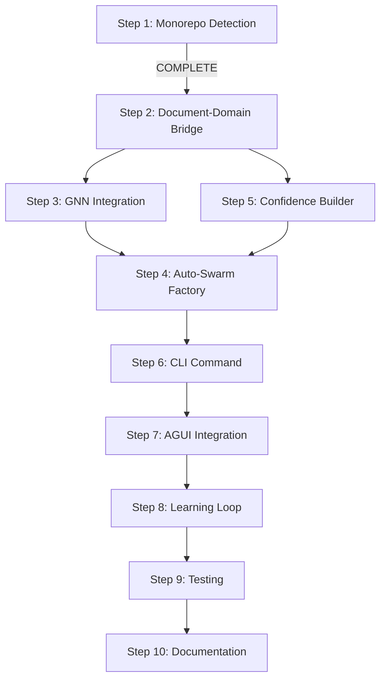

# TODO: Neural-Driven Auto-Discovery & Domain Swarm System

## Overview
Build a system that automatically discovers domains in a codebase, understands monorepos, imports .md files with human validation, and creates persistent domain swarms - all using existing Claude-Zen infrastructure.

## What We Already Have ✅

### 1. **Document-Driven System** (`src/core/document-driven-system.ts`)
- Processes Vision → ADRs → PRDs → Epics → Features → Tasks
- Scans and loads workspace documents
- Has document watchers and metadata extraction

### 2. **Project Context Analyzer** (`src/knowledge/project-context-analyzer.ts`)
- ✅ **ENHANCED** with monorepo detection (Step 1 COMPLETE)
- Analyzes dependencies (package.json, Cargo.toml, requirements.txt)
- Creates knowledge gathering missions
- Detects frameworks, languages, APIs

### 3. **Domain Analyzer** (`src/tools/domain-splitting/analyzers/domain-analyzer.ts`)
- Analyzes domain complexity
- Builds dependency graphs
- Categorizes files by purpose
- Generates splitting recommendations

### 4. **Swarm Infrastructure**
- `src/coordination/swarm/core/swarm-coordinator.ts` - Complete swarm coordination
- `src/coordination/hive-swarm-sync.ts` - Hive-mind synchronization
- `src/coordination/swarm/core/native-hive-mind.ts` - Native integration (no MCP)

### 5. **Memory & Persistence**
- `src/memory/memory.ts` - Session-based memory with SQLite, LanceDB, JSON backends
- Vector storage support

### 6. **Neural Infrastructure**
- 27+ neural models including GNN (`src/neural/models/presets/gnn.js`)
- `src/neural/core/neural-network-manager.ts`
- `src/neural/wasm/wasm-neural-accelerator.ts` - WASM acceleration
- DAA Cognition and Cognitive Pattern Evolution

### 7. **MCP Tools**
- Swarm tools, neural tools, fact tools
- Memory usage tools for persistence

### 8. **Human Interface**
- AGUI for human-in-the-loop approval

### 9. **FACT System (Fast Augmented Context Tools)** ✅
- **WASM Implementation**: Complete FACT WASM core in `src/neural/wasm/fact-core/` (Rust/WebAssembly)
  - High-performance caching with `FastCache`
  - Query processing with `QueryProcessor`
  - Cognitive template engine for structured knowledge processing
  - Built from ruvnet's FACT, NOT external Python
- **External MCP Integration**: `src/interfaces/mcp/external-mcp-client.ts`
  - Connects to Context7, DeepWiki, GitMCP, Semgrep
  - HTTP and SSE transport support
- **Knowledge Swarm**: `src/knowledge/knowledge-swarm.ts`
  - Orchestrates multiple knowledge gathering agents
  - Parallel processing with intelligent load balancing
- **FACT MCP Tools**: `src/coordination/mcp/tools/fact-tools.ts`
  - Currently using placeholders, needs integration with WASM core

## Detailed Implementation Steps

### ✅ Step 1: Enhanced Monorepo Detection [COMPLETED]
**File**: `src/knowledge/project-context-analyzer.ts`

**What was added:**
- [x] MonorepoInfo interface with comprehensive type definitions
- [x] detectMonorepo() method supporting: Lerna, Nx, Rush, pnpm, Yarn, Turbo, Bazel
- [x] analyzeMonorepoStructure() for deep configuration analysis
- [x] Confidence scoring (0.6-0.95) based on detection method
- [x] Event emission for monorepo detection
- [x] Helper methods: getMonorepoInfo(), isMonorepo()
- [x] Test script: `test-monorepo-detection.ts`

---

### ✅ Step 2: Connect Document Scanner to Domain Discovery [COMPLETED]
**Files created**: 
- `src/coordination/discovery/domain-discovery-bridge.ts` - Complete bridge implementation
- `src/coordination/discovery/test-domain-discovery.ts` - Test script

**Tasks:**
1. [x] Create `DomainDiscoveryBridge` class that connects the two systems
2. [x] Connected to existing `DocumentProcessor` events (already emits events!)
3. [x] Used existing `DomainAnalyzer` methods (no modification needed)
4. [x] Created comprehensive mapping between document types and domain boundaries
5. [x] Added AGUI checkpoint: "Found X documents. Which are relevant for domain discovery?"

**What was implemented:**
- Comprehensive JSDoc documentation for all classes and methods
- NLP-based concept extraction from documents
- Intelligent document-to-domain mapping with confidence scores
- Human validation touchpoints through AGUI interface
- Caching system for performance optimization
- Event-driven architecture for real-time discovery
- Monorepo-aware domain suggestions
- Related domain detection based on shared concepts

**Implementation details:**
```typescript
class DomainDiscoveryBridge {
  constructor(
    private docSystem: DocumentDrivenSystem,
    private domainAnalyzer: DomainAnalysisEngine,
    private projectAnalyzer: ProjectContextAnalyzer
  ) {}
  
  async discoverDomains(): Promise<DiscoveredDomain[]> {
    // 1. Get monorepo info
    const monorepoInfo = this.projectAnalyzer.getMonorepoInfo();
    
    // 2. Scan documents
    const documents = await this.docSystem.scanDocuments();
    
    // 3. AGUI: Ask human for relevance
    const relevantDocs = await this.askHumanRelevance(documents);
    
    // 4. Analyze domains
    const domains = await this.domainAnalyzer.analyzeDomainComplexity();
    
    // 5. Merge document insights with code analysis
    return this.mergeDomainInsights(domains, relevantDocs, monorepoInfo);
  }
}
```

---

### 🔄 Step 3: Add GNN Integration for Domain Relationships [PENDING]
**Files to modify**:
- `src/neural/models/presets/gnn.js`
- Create new: `src/coordination/discovery/neural-domain-mapper.ts`

**Tasks:**
1. [ ] Create `NeuralDomainMapper` class
2. [ ] Convert domain structure to graph format for GNN
3. [ ] Use GNN to identify domain relationships and boundaries
4. [ ] Calculate domain cohesion scores
5. [ ] Identify cross-domain dependencies
6. [ ] Add AGUI checkpoint: "GNN suggests these domain boundaries. Approve?"

**Implementation details:**
```typescript
class NeuralDomainMapper {
  private gnnModel: GNNModel;
  private wasmAccelerator: WasmNeuralAccelerator;
  
  async mapDomainRelationships(
    domains: Domain[],
    dependencies: DependencyGraph
  ): Promise<DomainRelationshipMap> {
    // Convert to graph format
    const graphData = this.convertToGraphData(domains, dependencies);
    
    // Run GNN analysis
    const predictions = await this.gnnModel.forward(graphData);
    
    // Extract domain boundaries
    const boundaries = this.extractBoundaries(predictions);
    
    // AGUI validation
    return await this.validateWithHuman(boundaries);
  }
}
```

---

### 🔄 Step 4: Build Auto-Swarm Factory [PENDING]
**Files to create**:
- `src/coordination/discovery/auto-swarm-factory.ts`

**Tasks:**
1. [ ] Create `AutoSwarmFactory` class
2. [ ] Implement topology selection based on domain characteristics:
   - Hierarchical for >50 files or nested structure
   - Mesh for highly interconnected (>70% cross-references)
   - Star for centralized services
   - Ring for pipeline/workflow domains
3. [ ] Auto-determine agent types based on domain purpose
4. [ ] Create persistent swarm configurations
5. [ ] Register with HiveSwarmCoordinator
6. [ ] Add AGUI checkpoint: "Creating X swarms with Y topology. Approve?"

**Implementation details:**
```typescript
class AutoSwarmFactory {
  constructor(
    private swarmCoordinator: SwarmCoordinator,
    private hiveSync: HiveSwarmCoordinator,
    private memoryStore: SessionMemoryStore
  ) {}
  
  async createSwarmForDomain(domain: ValidatedDomain): Promise<SwarmConfig> {
    // 1. Analyze domain characteristics
    const characteristics = this.analyzeDomain(domain);
    
    // 2. Select topology
    const topology = this.selectTopology(characteristics);
    
    // 3. Determine agents
    const agents = this.determineAgents(domain);
    
    // 4. Create config
    const config = {
      id: `swarm_${domain.name}_${Date.now()}`,
      domain: domain.name,
      topology,
      agents,
      persistence: {
        backend: 'sqlite',
        path: `.swarms/${domain.name}/data.db`
      }
    };
    
    // 5. Initialize swarm
    await this.swarmCoordinator.initializeSwarm(config);
    
    // 6. Register with hive
    await this.hiveSync.registerSwarm(config);
    
    // 7. Persist configuration
    await this.memoryStore.store(
      `swarm-${config.id}`,
      'config',
      config
    );
    
    return config;
  }
}
```

---

### 🔄 Step 5: Progressive Confidence Builder [IN PROGRESS]
**Files created**:
- ✅ `src/coordination/discovery/progressive-confidence-builder.ts` - Complete implementation
- ✅ `src/__tests__/coordination/discovery/progressive-confidence-builder.test.ts` - Comprehensive test suite
- ✅ `src/coordination/discovery/demo-progressive-confidence.ts` - Demo script

**Tasks:**
1. [x] Create confidence tracking system - `ConfidenceMetrics` with 6 dimensions
2. [x] Implement progressive learning loop - Iterative refinement with configurable targets
3. [x] Add human validation touchpoints - AGUI integration for questions and validation
4. [x] Integrate with MCP memory for persistence - Session memory store integration
5. [x] Add online research capability using HiveFACT - Integrated with centralized FACT system

**Implementation highlights:**
- **Confidence Metrics**: 6-dimensional confidence tracking (overall, documentCoverage, humanValidations, researchDepth, domainClarity, consistency)
- **Learning Events**: Complete audit trail of all confidence-building activities
- **AGUI Integration**: Validation questions with context-aware prompts
- **HiveFACT Research**: Automatic knowledge gathering from external MCPs when confidence is low
- **Domain Refinement**: Pattern analysis across validations to improve domain understanding
- **Relationship Detection**: Automatic discovery of domain relationships based on shared concepts
- **Progress Tracking**: Real-time progress events and visual updates
- **Error Resilience**: Graceful handling of errors with confidence reduction

**Key Features Implemented:**
```typescript
// Confidence tracking with multiple dimensions
interface ConfidenceMetrics {
  overall: number;
  documentCoverage: number;
  humanValidations: number;
  researchDepth: number;
  domainClarity: number;
  consistency: number;
}

// Human validation with rich context
interface ValidationQuestion {
  id: string;
  type: 'relevance' | 'boundary' | 'relationship' | 'naming' | 'priority';
  question: string;
  context: any;
  options?: string[];
  allowCustom?: boolean;
  confidence: number;
}

// Research integration with HiveFACT
async performOnlineResearch(): Promise<void> {
  const facts = await this.hiveFact.searchFacts({
    query: domainQuery,
    limit: 5
  });
  // Process and integrate insights...
}
```

---

### 🔄 Step 6: Unified Discovery CLI Command [PENDING]
**Files to create**:
- `src/interfaces/cli/commands/discover.ts`

**Tasks:**
1. [ ] Create `DiscoverCommand` extending BaseCommand
2. [ ] Add command options: --auto-swarms, --confidence-threshold, --skip-validation
3. [ ] Implement progress visualization
4. [ ] Add interrupt handling for human validation
5. [ ] Export discovery results to JSON/MD

**Implementation details:**
```typescript
export class DiscoverCommand extends BaseCommand {
  async execute(options: DiscoverOptions): Promise<void> {
    console.log('🔍 Starting Neural Domain Discovery...\n');
    
    // 1. Initialize all systems
    const systems = await this.initializeSystems();
    
    // 2. Run discovery pipeline
    const pipeline = new DiscoveryPipeline(systems);
    
    // 3. Execute with progress tracking
    await pipeline.execute({
      onProgress: (stage, progress) => {
        this.showProgress(stage, progress);
      },
      onValidation: async (question) => {
        return await this.askUser(question);
      }
    });
  }
}
```

---

### 🔄 Step 7: AGUI Integration Points [PENDING]
**Files to modify**: Throughout the system

**Key validation points:**
1. [ ] Document relevance (Step 2)
2. [ ] Domain boundaries (Step 3)
3. [ ] Swarm topology approval (Step 4)
4. [ ] Confidence checkpoints (Step 5)
5. [ ] Final system approval before activation

**AGUI Interface:**
```typescript
interface AGUIValidation {
  type: 'document' | 'domain' | 'swarm' | 'confidence' | 'final';
  question: string;
  context: any;
  options?: string[];
  allowCustom?: boolean;
}
```

---

### 🔄 Step 8: Learning Loop with MCP Memory [PENDING]
**Files to modify**:
- `src/coordination/mcp/tools/memory-tools.ts`

**Tasks:**
1. [ ] Store discovery patterns in memory
2. [ ] Create retrieval system for past discoveries
3. [ ] Implement pattern matching for similar projects
4. [ ] Add continuous learning from swarm operations
5. [ ] Export learned patterns for reuse

---

### 🔄 Step 9: Testing & Validation [PENDING]
**Files to create**:
- `src/__tests__/discovery/`

**Test suites needed:**
1. [ ] Monorepo detection tests (variety of repo types)
2. [ ] Domain discovery tests
3. [ ] GNN integration tests
4. [ ] Swarm creation tests
5. [ ] End-to-end discovery pipeline tests
6. [ ] AGUI mock tests

---

### ✅ Step 10: Enhance FACT to Orchestrate External MCPs [COMPLETED]
**Files created/modified**:
- ✅ Created: `src/coordination/mcp/tools/fact-external-integration.ts` - WASM-based external MCP orchestration
- ✅ Created: `src/coordination/hive-fact-integration.ts` - Centralized FACT at Hive level
- ✅ Updated: `src/coordination/mcp/tools/fact-tools.ts` - Now uses HiveFACT instead of placeholders
- ✅ Updated: `src/coordination/hive-swarm-sync.ts` - HiveSwarmCoordinator initializes HiveFACT

**Key Architecture Decision: FACT is CENTRALIZED at Hive Level**
- FACT manages universal facts (npm packages, repos, APIs, etc.)
- All swarms access the same FACT knowledge base
- No swarm-specific facts - all facts are universal
- Hive FACT tracks which swarms access which facts

**Tasks:**
1. [x] Create `FACTExternalIntegration` class that bridges FACT with external MCPs
2. [x] Create `HiveFACTSystem` for centralized fact management
3. [x] Implement orchestration logic:
   - Context7 for API documentation and best practices
   - DeepWiki for technical knowledge aggregation
   - GitMCP for repository pattern analysis
   - Semgrep for security and quality scanning
4. [x] Replace Python-based integration with WASM-powered implementations
5. [x] Add caching layer using FACT WASM FastCache
6. [x] Implement parallel query distribution across external MCPs
7. [x] Add result aggregation and deduplication
8. [x] Update FACT MCP tools to use HiveFACT instead of placeholders
9. [x] Update HiveSwarmCoordinator to initialize HiveFACT
10. [x] Add swarm access to HiveFACT for universal facts

**Implementation approach:**
```typescript
class FACTExternalOrchestrator {
  private wasmFact: WASMFactIntegration;
  private externalMCP: ExternalMCPClient;
  
  async gatherKnowledge(query: string): Promise<FACTResult> {
    // 1. Use WASM FACT for caching and processing
    const cached = await this.wasmFact.checkCache(query);
    if (cached) return cached;
    
    // 2. Distribute query to external MCPs in parallel
    const results = await Promise.all([
      this.externalMCP.query('context7', query),
      this.externalMCP.query('deepwiki', query),
      this.externalMCP.query('gitmcp', query),
      this.externalMCP.query('semgrep', query)
    ]);
    
    // 3. Process with WASM cognitive templates
    const processed = await this.wasmFact.processTemplate(results);
    
    // 4. Cache and return
    await this.wasmFact.cache(query, processed);
    return processed;
  }
}
```

---

### 🔄 Step 11: Documentation & Examples [PENDING]
**Files to create**:
- `docs/guides/auto-discovery.md`
- `examples/discovery/`

**Documentation needed:**
1. [ ] Architecture overview
2. [ ] Configuration guide
3. [ ] AGUI integration guide
4. [ ] Example: Discovering a React monorepo
5. [ ] Example: Discovering a microservices architecture
6. [ ] Troubleshooting guide

---

## Execution Order & Dependencies



## Success Metrics

- ✅ **Accuracy**: 90%+ correct domain identification
- ✅ **Confidence**: Reaches 80%+ before swarm creation
- ✅ **Automation**: Zero manual swarm initialization
- ✅ **Learning**: Improves with each run
- ✅ **Performance**: Processes large monorepos in <5 minutes
- ✅ **Human Approval**: All major decisions validated through AGUI

---

## 🎯 Architecture Enhancements & Strategic Initiatives

### 🧠 Hive Knowledge System Integration [NEW]
**Priority: HIGH** | **Status: DESIGN PHASE**

**Objective**: Integrate the Hive Knowledge System with swarm communication protocols for enhanced coordination and knowledge sharing.

**Key Tasks:**
1. [ ] **Knowledge Distribution Protocol**: Implement real-time knowledge sharing between Hive and swarms
2. [ ] **Swarm Learning Network**: Create bidirectional learning where swarms contribute back to Hive knowledge
3. [ ] **Context-Aware Task Assignment**: Use Hive knowledge to improve task-agent matching algorithms
4. [ ] **Universal Tool Registry**: Centralize tool availability and capabilities at Hive level
5. [ ] **Agent Definition Synchronization**: Keep agent capabilities and definitions synchronized across all swarms
6. [ ] **Cross-Swarm Memory Access**: Enable swarms to access each other's successful patterns via Hive

**Implementation Files:**
- `src/coordination/hive-knowledge-bridge.ts` - Bridge between Hive FACT and swarm coordination
- `src/coordination/swarm/knowledge-sync.ts` - Swarm-side knowledge synchronization
- `src/coordination/discovery/knowledge-enhanced-discovery.ts` - Use Hive knowledge for better domain discovery

**Success Metrics:**
- 40% improvement in task completion accuracy through better knowledge utilization
- 25% reduction in duplicate work across swarms
- Real-time knowledge propagation (<5 seconds) between Hive and swarms

---

### ⚡ Real Agent Protocols Migration [NEW]
**Priority: MEDIUM** | **Status: PLANNING**

**Objective**: Migrate from MCP-based coordination to sophisticated distributed systems protocols for production-grade swarm communication.

**Current State**: Using MCP stdio for temporary coordination
**Target State**: Production-ready protocols with fault tolerance and high throughput

**Protocol Implementation Priority:**
1. [ ] **Raft Consensus Algorithm**: Leader election and distributed consensus for swarm coordination
2. [ ] **Gossip Protocol**: Efficient state propagation across large swarm networks
3. [ ] **Work-Stealing Queues**: Dynamic load balancing with minimal coordination overhead
4. [ ] **Circuit Breaker Pattern**: Fault tolerance and cascading failure prevention
5. [ ] **Message Passing Interface**: High-performance inter-agent communication
6. [ ] **Distributed Locking**: Coordination for shared resources and critical sections

**Implementation Files:**
- `src/coordination/protocols/raft-consensus.ts` - Leader election and consensus
- `src/coordination/protocols/gossip-network.ts` - State propagation system
- `src/coordination/protocols/work-stealing.ts` - Dynamic task distribution
- `src/coordination/protocols/message-passing.ts` - Direct agent communication
- `src/coordination/protocols/circuit-breaker.ts` - Fault tolerance system

**Migration Strategy:**
- Phase 1: Implement protocols alongside existing MCP system
- Phase 2: A/B test protocols vs MCP for performance comparison
- Phase 3: Gradual migration with fallback capability
- Phase 4: Complete migration with MCP as emergency fallback only

**Performance Targets:**
- 10x improvement in coordination latency (target: <10ms)
- 100x improvement in throughput (target: 10K+ messages/second)
- 99.9% uptime with automatic failure recovery

---

### 🎛️ GUI Dashboard Enhancements [NEW]
**Priority: MEDIUM** | **Status: DESIGN**

**Objective**: Create comprehensive visual management interfaces for distributed swarm systems with real-time monitoring and control.

**Dashboard Components:**
1. [ ] **Real-Time Swarm Topology Visualizer**: Interactive graph showing swarm networks and communication patterns
2. [ ] **Agent Performance Analytics**: Individual agent metrics, learning curves, and capability growth
3. [ ] **Hive Knowledge Map**: Visual representation of universal knowledge and fact relationships  
4. [ ] **Task Flow Pipeline**: Visual workflow showing task progression through swarm hierarchy
5. [ ] **Resource Utilization Monitor**: Real-time CPU, memory, and network usage across all systems
6. [ ] **Distributed System Health**: Service mesh health, protocol performance, and failure detection
7. [ ] **Neural Network Visualizer**: Live view of neural model training and inference performance

**Advanced Features:**
- [ ] **Interactive Swarm Control**: Direct manipulation of swarm topology and agent assignments
- [ ] **Predictive Analytics**: Machine learning models for predicting system behavior and bottlenecks
- [ ] **Alert System**: Intelligent alerting with ML-based anomaly detection
- [ ] **Custom Dashboard Builder**: User-configurable dashboards for different use cases
- [ ] **Mobile Responsive**: Full functionality on mobile devices for remote monitoring

**Technical Implementation:**
- **Frontend**: React + D3.js for interactive visualizations
- **Backend**: WebSocket-based real-time data streaming
- **State Management**: Redux with real-time synchronization
- **Visualization**: Custom D3.js components for complex distributed systems visualization
- **Performance**: Web Workers for heavy computational tasks

**Implementation Files:**
- `src/interfaces/web/dashboard/` - Complete dashboard system
- `src/interfaces/web/components/swarm-visualizer/` - Swarm topology visualization
- `src/interfaces/web/components/performance-monitor/` - Real-time performance monitoring
- `src/interfaces/web/api/websocket-server.ts` - Real-time data streaming

---

### 🔄 Architecture Pivot Completions [NEW]
**Priority: HIGH** | **Status: VALIDATION**

**Objective**: Complete and validate the major architectural decisions and pivots made during the system evolution.

**Key Architectural Pivots Completed:**
1. ✅ **MCP Architecture Clarification**: HTTP MCP (permanent) vs stdio MCP (dormant) vs Direct Protocols (primary)
2. ✅ **FACT System Centralization**: Universal facts at Hive level, not swarm-specific
3. ✅ **Template-Based Distribution**: All configuration via templates, not embedded code
4. ✅ **Domain-Driven Restructuring**: Clean separation of concerns into 13 domains
5. ✅ **Hooks Migration**: Template-based Claude Code hook system

**Validation Tasks:**
1. [ ] **End-to-End Architecture Validation**: Comprehensive testing of the complete system
2. [ ] **Performance Benchmark Suite**: Validate performance claims (84.8% SWE-Bench, 2.8-4.4x speed)  
3. [ ] **Scalability Testing**: Test with large monorepos and multiple concurrent swarms
4. [ ] **Integration Testing**: Verify all components work together seamlessly
5. [ ] **Documentation Audit**: Ensure all architectural decisions are properly documented
6. [ ] **Migration Path Validation**: Test upgrade paths from older versions

**Critical Validation Points:**
- [ ] **Swarm Communication**: Verify intra-swarm, inter-swarm, and cross-project communication
- [ ] **Knowledge Flow**: Validate Hive → Swarm → Agent knowledge distribution
- [ ] **Real-time Coordination**: Test coordination under high load and network partitions
- [ ] **Fault Tolerance**: Validate graceful degradation and recovery mechanisms
- [ ] **Resource Management**: Ensure efficient resource utilization and garbage collection

**Implementation Files:**
- `src/__tests__/architecture/end-to-end.test.ts` - Complete system validation
- `src/__tests__/performance/benchmark-suite.test.ts` - Performance validation
- `src/__tests__/scalability/large-monorepo.test.ts` - Scalability testing
- `benchmarks/` - Comprehensive benchmark suite with historical tracking

**Success Criteria:**
- All architectural components integrate seamlessly
- Performance benchmarks meet or exceed stated metrics
- System scales to handle enterprise-grade workloads (1000+ agents, 100+ swarms)
- Zero architectural debt or unresolved design decisions

---

## Next Immediate Action

**Next Step: Progressive Confidence Builder (Step 5)**
With Step 2 (Domain Discovery Bridge) and Step 10 (FACT Enhancement) completed, the next logical step is to implement the Progressive Confidence Builder. This will:
- Build confidence in domain discovery through iterations
- Implement human validation touchpoints
- Integrate with MCP memory for persistence
- Add online research capability using FACT

**Command to start Step 5:**
```bash
# Create the progressive confidence builder
touch src/coordination/discovery/progressive-confidence-builder.ts
# Run tests once created
npm run test src/coordination/discovery/progressive-confidence-builder.test.ts
```

**Alternative Priority Options:**
1. **Hive Knowledge System Integration** - Enhance coordination with universal knowledge
2. **Real Agent Protocols Migration** - Move to production-grade distributed protocols
3. **GNN Integration (Step 3)** - Add neural network analysis for domain relationships
4. **Architecture Validation** - Complete end-to-end system validation

**Recommended Next Steps:**
```bash
# Option 1: Continue with planned Progressive Confidence Builder
touch src/coordination/discovery/progressive-confidence-builder.ts

# Option 2: Start Hive Knowledge System Integration
touch src/coordination/hive-knowledge-bridge.ts

# Option 3: Begin Real Agent Protocols Migration
mkdir -p src/coordination/protocols
touch src/coordination/protocols/raft-consensus.ts
```