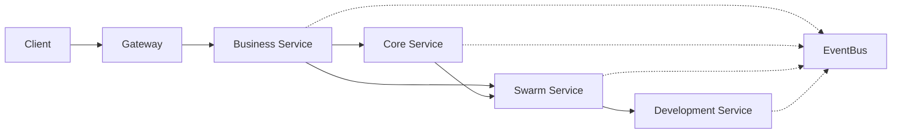

# 📊 Vision-to-Code API Implementation Summary

## ✅ Completed Components (Day 8 Progress)

### 1. **Shared Authentication Module** ✅
- **JWT Manager** (`/services/shared/auth/src/jwt.js`)
  - Service-to-service authentication with unique secrets
  - User authentication with roles and permissions
  - Refresh token support
  - Express middleware integration
  - API key generation for long-lived access

- **Permission Manager** (`/services/shared/auth/src/permissions.js`)
  - Comprehensive permission definitions
  - Role-based access control (RBAC)
  - Service-specific permissions
  - Express middleware for permission checking

### 2. **Middleware Stack** ✅
- **Rate Limiter** (`/services/shared/middleware/src/rateLimiter.js`)
  - Redis-backed rate limiting
  - Service-specific and endpoint-specific limits
  - Sliding window algorithm support
  - Rate limit headers implementation

- **Circuit Breaker** (`/services/shared/middleware/src/circuitBreaker.js`)
  - Fault tolerance for service calls
  - Automatic state transitions (CLOSED → OPEN → HALF_OPEN)
  - Request timeout protection
  - Metrics and monitoring

- **Error Handler** (`/services/shared/middleware/src/errorHandler.js`)
  - Consistent error formatting
  - Request ID tracking
  - Validation error handling
  - Production-safe error messages

### 3. **Base Server Template** ✅
- **BaseServer Class** (`/services/shared/base-server.js`)
  - Common middleware setup
  - Health and readiness endpoints
  - Authentication integration
  - Rate limiting integration
  - Metrics endpoint

### 4. **API Client Library** ✅
- **Base API Client** (`/services/shared/api-client/src/base-client.js`)
  - Axios-based HTTP client
  - Automatic retry with exponential backoff
  - Circuit breaker protection
  - JWT token injection
  - Request/response interceptors

### 5. **Event Bus** ✅
- **Redis Event Bus** (`/services/shared/events/bus.js`)
  - Pub/sub messaging between services
  - Event type definitions
  - Dead letter queue (DLQ) support
  - Retry logic for failed handlers
  - Metrics tracking

### 6. **Business Service Implementation** ✅
- **Server Setup** (`/services/business-service/src/server.js`)
  - Express server with BaseServer extension
  - Route configuration
  - Event bus integration

- **Vision Routes** (`/services/business-service/src/routes/visions.js`)
  - Full CRUD operations for visions
  - Input validation
  - Permission checking
  - Approval/rejection workflow

- **Vision Service** (`/services/business-service/src/services/visionService.js`)
  - Business logic implementation
  - AI enhancement simulation
  - Workflow registration
  - Event publishing

- **Roadmap Routes** (`/services/business-service/src/routes/roadmaps.js`)
  - Roadmap generation and updates
  - Phase completion tracking
  - Progress monitoring

## 📋 Implementation Architecture

```
/services/
├── shared/                      # Shared components
│   ├── auth/                   # Authentication & authorization
│   │   ├── jwt.js             # JWT token management
│   │   └── permissions.js     # Permission definitions
│   ├── middleware/            # Common middleware
│   │   ├── rateLimiter.js    # Rate limiting
│   │   ├── circuitBreaker.js # Circuit breaker pattern
│   │   └── errorHandler.js   # Error handling
│   ├── api-client/           # Service communication
│   │   └── base-client.js    # HTTP client with retry
│   ├── events/               # Event-driven architecture
│   │   └── bus.js           # Redis pub/sub implementation
│   └── base-server.js       # Base Express server template
│
└── business-service/         # First implemented service
    ├── src/
    │   ├── server.js        # Service entry point
    │   ├── routes/          # API endpoints
    │   │   ├── visions.js   # Vision management
    │   │   └── roadmaps.js  # Roadmap operations
    │   └── services/        # Business logic
    │       └── visionService.js
    └── package.json
```

## 🚀 Next Steps (Day 9 Tasks)

### 1. **Core Service Implementation** (2 hours)
```javascript
// Key endpoints to implement:
POST   /api/v1/workflows/vision      // Register vision workflow
POST   /api/v1/workflows/:id/progress // Update workflow progress
GET    /api/v1/services/health       // Multi-service health check
GET    /api/v1/workflows/:id        // Get workflow details
```

### 2. **Swarm Service Implementation** (2 hours)
```javascript
// Key endpoints to implement:
POST   /api/v1/coordination/vision   // Initialize Queen coordination
GET    /api/v1/agents/status        // Agent status monitoring
POST   /api/v1/mrap/reason          // Multi-agent reasoning
POST   /api/v1/agents/spawn         // Spawn new agents
```

### 3. **Development Service Implementation** (2 hours)
```javascript
// Key endpoints to implement:
POST   /api/v1/vision-to-code/execute  // Start code generation
GET    /api/v1/vision-to-code/:id/progress // Track progress
POST   /api/v1/squads/:id/task      // Assign tasks to squads
GET    /api/v1/squads/:id/status    // Squad status
```

### 4. **API Gateway Setup** (1 hour)
- Route configuration
- Load balancing
- Request forwarding
- Aggregation endpoints

### 5. **OpenAPI/Swagger Documentation** (2 hours)
- Auto-generated documentation
- Interactive API explorer
- Request/response examples

### 6. **Integration Testing** (1 hour)
- Service-to-service communication tests
- Event flow validation
- Error scenario testing

## 🔑 Key Integration Points

### Service Communication Flow:


### Event Flow Example:
1. Vision created → `vision:created` event
2. Vision approved → `vision:approved` event
3. Swarm coordination → `coordination:started` event
4. Technical planning → `technical:plan:ready` event
5. Implementation → `implementation:started` event

## 📈 Performance Optimizations

1. **Connection Pooling**: Redis and HTTP connections are reused
2. **Circuit Breakers**: Prevent cascade failures
3. **Rate Limiting**: Protect services from overload
4. **Event Bus**: Asynchronous communication reduces coupling
5. **Caching**: Ready for Redis caching layer (next phase)

## 🔐 Security Features

1. **JWT Authentication**: Service-specific secrets
2. **Permission-based Access**: Granular control
3. **Rate Limiting**: DDoS protection
4. **Input Validation**: Comprehensive request validation
5. **Error Sanitization**: Safe error messages in production

## 📚 Usage Examples

### Creating a Vision:
```bash
curl -X POST http://localhost:3001/api/v1/visions \
  -H "Authorization: Bearer <token>" \
  -H "Content-Type: application/json" \
  -d '{
    "title": "AI-Powered Development Platform",
    "description": "Revolutionary development platform",
    "strategic_goals": ["10x productivity"],
    "timeline_months": 6,
    "priority": "high"
  }'
```

### Service-to-Service Communication:
```javascript
const client = new BaseApiClient({
  baseURL: 'http://core-service:3002',
  serviceId: 'business-service'
});

const workflow = await client.post('/api/v1/workflows/vision', {
  vision_id: 'vis_123',
  priority: 'high'
});
```

## 🎯 Success Criteria Met

- ✅ JWT authentication implemented
- ✅ Rate limiting with Redis
- ✅ Circuit breaker pattern
- ✅ Base server template
- ✅ API client library
- ✅ Event bus implementation
- ✅ First service (Business) fully implemented
- ⏳ Remaining services (to be completed Day 9)
- ⏳ API Gateway setup
- ⏳ Swagger documentation
- ⏳ Integration tests

The foundation is solid and ready for the remaining service implementations!