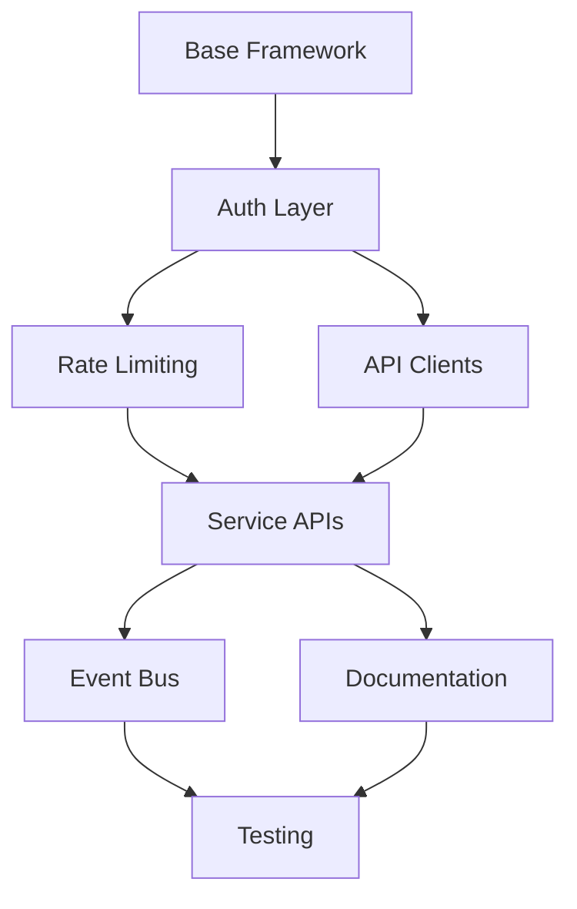

# 📋 Vision-to-Code API Implementation Plan
## Week 2, Day 8-9: REST API Layer Implementation

### 🎯 **Implementation Strategy**

#### **Day 8: Foundation & Core Infrastructure**
1. **Base API Framework Setup** (2 hours)
   - Express.js server configuration for each service
   - Middleware stack (CORS, body parser, compression)
   - Environment configuration management
   - Logging and request tracking

2. **Authentication & Security Layer** (3 hours)
   - JWT token generation and validation
   - Service-to-service authentication
   - API key management for external access
   - Permission-based access control

3. **Rate Limiting & Circuit Breaker** (2 hours)
   - Redis-based rate limiter implementation
   - Circuit breaker pattern for service resilience
   - Configurable limits per service/endpoint
   - Rate limit headers implementation

4. **API Client Libraries** (3 hours)
   - TypeScript SDK for service communication
   - Retry logic with exponential backoff
   - Request/response interceptors
   - Error handling and transformation

#### **Day 9: Service Implementation & Documentation**
1. **Service API Implementation** (4 hours)
   - Business Service endpoints
   - Core Service workflow registry
   - Swarm Service coordination APIs
   - Development Service execution endpoints

2. **Event Bus Integration** (2 hours)
   - Redis Pub/Sub for event distribution
   - Event schema validation
   - Event replay capability
   - Dead letter queue handling

3. **OpenAPI/Swagger Documentation** (2 hours)
   - Auto-generated documentation
   - Interactive API explorer
   - Request/response examples
   - Authentication documentation

4. **Testing & Monitoring** (2 hours)
   - Integration test suite
   - Performance benchmarks
   - Health check endpoints
   - Metrics collection

### 🏗️ **Critical Path Analysis**



**Critical Dependencies:**
1. Authentication must be complete before service APIs
2. Rate limiting needed for production readiness
3. API clients required for service-to-service communication
4. Event bus essential for workflow coordination

### 📁 **Directory Structure**

```
/services/
├── api-gateway/
│   ├── src/
│   │   ├── middleware/
│   │   │   ├── auth.js
│   │   │   ├── rateLimiter.js
│   │   │   ├── circuitBreaker.js
│   │   │   └── errorHandler.js
│   │   ├── routes/
│   │   │   ├── proxy.js
│   │   │   └── health.js
│   │   └── server.js
│   └── package.json
├── shared/
│   ├── api-client/
│   │   ├── src/
│   │   │   ├── clients/
│   │   │   │   ├── businessService.js
│   │   │   │   ├── coreService.js
│   │   │   │   ├── swarmService.js
│   │   │   │   └── developmentService.js
│   │   │   ├── interceptors/
│   │   │   └── index.js
│   │   └── package.json
│   ├── auth/
│   │   ├── jwt.js
│   │   └── permissions.js
│   └── events/
│       ├── bus.js
│       └── schemas/
├── business-service/
│   ├── src/
│   │   ├── routes/
│   │   │   ├── visions.js
│   │   │   └── roadmaps.js
│   │   └── server.js
│   └── package.json
├── core-service/
│   ├── src/
│   │   ├── routes/
│   │   │   ├── workflows.js
│   │   │   └── services.js
│   │   └── server.js
│   └── package.json
├── swarm-service/
│   ├── src/
│   │   ├── routes/
│   │   │   ├── coordination.js
│   │   │   ├── agents.js
│   │   │   └── mrap.js
│   │   └── server.js
│   └── package.json
└── development-service/
    ├── src/
    │   ├── routes/
    │   │   ├── visionToCode.js
    │   │   └── squads.js
    │   └── server.js
    └── package.json
```

### 🚀 **Implementation Priority**

1. **High Priority (Must Have)**
   - JWT authentication
   - Basic rate limiting
   - Core service endpoints
   - Health checks
   - Event bus foundation

2. **Medium Priority (Should Have)**
   - Circuit breaker
   - API client libraries
   - Swagger documentation
   - Comprehensive error handling
   - Metrics collection

3. **Low Priority (Nice to Have)**
   - Advanced rate limiting strategies
   - Request caching
   - API versioning headers
   - GraphQL alternative endpoints
   - WebSocket support

### 📊 **Success Metrics**

- **Response Time**: < 100ms P95 for all endpoints
- **Availability**: 99.9% uptime per service
- **Rate Limiting**: Zero service overload incidents
- **Documentation**: 100% endpoint coverage
- **Security**: Zero authentication bypasses
- **Testing**: > 80% code coverage

### 🔄 **Next Steps**

1. Create base Express.js template with all middleware
2. Implement JWT authentication module
3. Build rate limiter with Redis
4. Create first service API (Business Service)
5. Set up automated API documentation