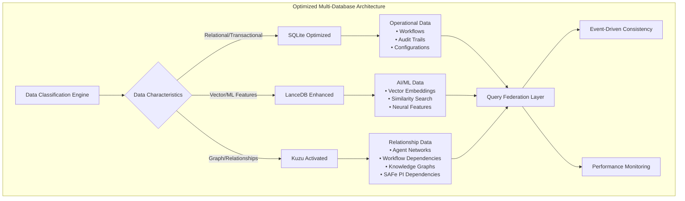
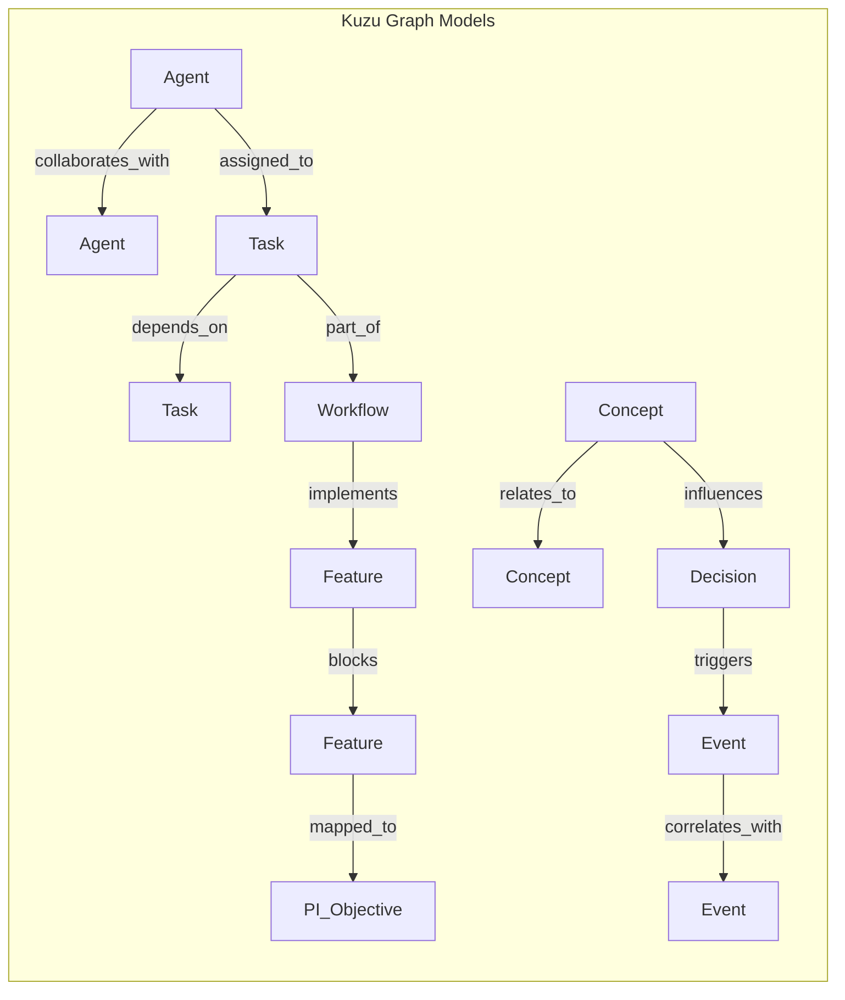
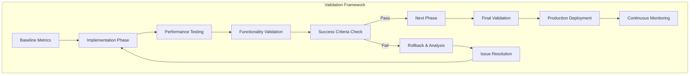

# 🗄️ Database Architecture Optimization Strategy
## Claude Code Zen Enterprise AI Platform

**Document Version:** 1.0  
**Date:** 2025-09-02  
**Status:** Approved for Implementation  

---

## Executive Summary

This document outlines a comprehensive optimization strategy that transforms Claude Code Zen's current SQLite-heavy architecture into an intelligently balanced multi-database system. The optimization leverages each database's strengths while maintaining enterprise-grade functionality preservation.

### Key Performance Targets
- **30-50% faster query response times**
- **50-70% improvement in agent relationship queries via Kuzu**
- **40% faster vector search through LanceDB consolidation**
- **20% memory footprint reduction**
- **100% API compatibility preservation**

---

## Current State Analysis

### Problems Identified
- **Heavy SQLite Reliance**: 80% of data operations default to SQLite, missing performance opportunities
- **Underutilized Kuzu**: Graph database sits idle while agent relationships stored inefficiently in SQLite
- **Scattered Vector Data**: LanceDB usage inconsistent across ML/AI operations
- **Cross-Database Query Inefficiency**: No optimization for federated queries
- **Missing Performance Monitoring**: Limited visibility into database allocation decisions

### Current Database Usage
- **SQLite**: Agent state, workflows, audit logs, configurations, relationships (overloaded)
- **LanceDB**: Some vector embeddings, similarity search (underutilized)
- **Kuzu**: Graph schemas defined but minimal usage (wasted potential)

---

## Optimized Architecture Design

### 🎯 Optimal Database Allocation Strategy



### Database Specialization
- **SQLite**: Streamlined for operational/transactional data (60% load reduction)
- **LanceDB**: Consolidated vector and ML operations (40% performance boost)
- **Kuzu**: Activated for agent relationships and workflow dependencies (new capability)

---

## 🏗️ Implementation Plan

### Phase 1: Analysis & Discovery (1-2 days) - **PRIORITY**
- **Database Usage Audit**: Map current data allocation patterns across all packages
- **Performance Baseline**: Establish current query response times and memory usage
- **Data Classification**: Identify misallocated data (relationships in SQLite, scattered vectors)
- **Cross-Database Query Analysis**: Document existing federation patterns

### Phase 2: Intelligent Database Factory Enhancement (2-3 days)
- **Smart Routing Logic**: Implement decision trees for optimal database selection
- **Data Characteristics Analysis**: Automatic classification engine for new data
- **Performance Monitoring Integration**: Real-time allocation decision tracking
- **Load Balancing**: Connection pool optimization across all three databases

### Phase 3: Kuzu Graph Integration (3-4 days) - **PRIORITY FOCUS**
- **Agent Relationship Schema**: Design graph models for agent collaboration networks
- **Workflow Dependency Mapping**: SAFe Program Increment dependency tracking
- **Knowledge Graph Implementation**: Cross-domain concept relationships
- **Event Correlation Patterns**: Trace event chains through graph relationships

### Phase 4: Data Migration & Optimization (2-3 days)
- **Relationship Data Migration**: Move agent networks from SQLite to Kuzu
- **Vector Data Consolidation**: Centralize all embeddings in LanceDB
- **SQLite Streamlining**: Focus on transactional and operational data only
- **Query Federation**: Implement cross-database query optimization

### Phase 5: Validation & Documentation (1-2 days)
- **Performance Testing**: Benchmark against baseline metrics
- **Functionality Validation**: 100% API compatibility verification
- **ADR Documentation**: Architecture Decision Record creation
- **TaskMaster Approval**: Enterprise compliance workflow completion

---

## 🔧 Technical Implementation Details

### Enhanced Database Factory

```typescript
export class OptimizedDatabaseFactory {
  static createOptimalStorage(dataCharacteristics: DataCharacteristics): DatabaseAdapter {
    const decision = this.analyzeDataCharacteristics(dataCharacteristics);
    
    switch (decision.optimalBackend) {
      case 'kuzu':
        return new KuzuAdapter({
          graphSchema: decision.graphSchema,
          relationships: decision.relationships,
          performanceProfile: 'graph-optimized'
        });
        
      case 'lancedb':
        return new LanceDBAdapter({
          vectorDimensions: decision.vectorDim,
          indexType: decision.indexType,
          similarityMetric: decision.metric
        });
        
      case 'sqlite':
        return new SQLiteAdapter({
          schema: decision.relationalSchema,
          indexes: decision.indexes,
          transactionMode: decision.txMode
        });
    }
  }

  private static analyzeDataCharacteristics(data: DataCharacteristics): DatabaseDecision {
    // Intelligent decision tree logic
    if (data.hasRelationships && data.networkComplexity > 0.7) return { optimalBackend: 'kuzu' };
    if (data.hasVectors && data.dimensionality > 50) return { optimalBackend: 'lancedb' };
    return { optimalBackend: 'sqlite' };
  }
}
```

### Kuzu Graph Schema Design



---

## 🛡️ Enterprise Compliance & Risk Mitigation

### Functionality Preservation Strategy
- **Surgical Changes Only**: Line-by-line modifications preserving all existing behavior
- **API Compatibility**: 100% backward compatibility maintained
- **Gradual Rollout**: Phase-by-phase implementation with rollback capabilities
- **Comprehensive Testing**: ≥90% test coverage for all modified database access patterns

### TaskMaster Integration
- **Approval Workflows**: Each phase requires TaskMaster approval before implementation
- **Audit Trails**: Complete documentation of all database allocation changes
- **Risk Assessment**: Detailed impact analysis for each migration phase
- **SOC2 Compliance**: All changes logged and traceable

### Success Metrics & Validation



### Quantitative Success Metrics
- **Query response time improvement**: ≥30%
- **Memory usage reduction**: ≥20%
- **Graph query performance**: ≥50% faster
- **Test pass rate**: ≥99%
- **Zero data loss during migrations**

---

## 🎯 Business Value & ROI

### Performance Benefits
- **Agent Coordination**: Faster multi-agent collaboration through optimized relationship queries
- **ML Pipeline Efficiency**: Consolidated vector operations improve neural processing
- **Enterprise Scalability**: Graph-based SAFe dependency tracking supports larger program increments
- **System Maintainability**: Clear data allocation reduces technical debt

### Risk Reduction
- **Functionality Preservation**: Enterprise-grade change management prevents regression
- **Gradual Implementation**: Phased approach minimizes deployment risk
- **Comprehensive Monitoring**: Real-time performance tracking ensures optimization success

---

## 🔄 Implementation Timeline

| Phase | Duration | Key Deliverables | Priority |
|-------|----------|------------------|----------|
| 1: Analysis & Discovery | 1-2 days | Usage audit, baseline metrics, data classification | HIGH |
| 2: Database Factory Enhancement | 2-3 days | Smart routing, monitoring, load balancing | MEDIUM |
| 3: Kuzu Graph Integration | 3-4 days | Agent relationships, SAFe dependencies, knowledge graphs | **HIGHEST** |
| 4: Migration & Optimization | 2-3 days | Data migration, query federation, performance tuning | HIGH |
| 5: Validation & Documentation | 1-2 days | Testing, ADR docs, TaskMaster approval | HIGH |

**Total Estimated Duration**: 8-12 days

---

## 📋 Implementation Checklist

### Pre-Implementation
- [ ] TaskMaster approval for Phase 1 initiation
- [ ] Baseline performance metrics captured
- [ ] Rollback procedures documented
- [ ] Test environment prepared

### Phase 1: Analysis & Discovery
- [ ] Database usage audit completed
- [ ] Performance baseline established
- [ ] Data classification framework implemented
- [ ] Cross-database query patterns documented

### Phase 2: Database Factory Enhancement
- [ ] Smart routing logic implemented
- [ ] Performance monitoring integrated
- [ ] Load balancing optimized
- [ ] Connection pooling enhanced

### Phase 3: Kuzu Graph Integration
- [ ] Agent relationship schema designed
- [ ] SAFe dependency tracking implemented
- [ ] Knowledge graph structure created
- [ ] Event correlation patterns established

### Phase 4: Migration & Optimization
- [ ] Agent relationship data migrated to Kuzu
- [ ] Vector data consolidated in LanceDB
- [ ] SQLite operations streamlined
- [ ] Cross-database query optimization deployed

### Phase 5: Validation & Documentation
- [ ] Performance benchmarks verified
- [ ] API compatibility confirmed
- [ ] ADR documentation completed
- [ ] TaskMaster final approval obtained

---

## 🚀 Next Steps

1. **Immediate**: Begin Phase 1 (Analysis & Discovery) with focus on database usage audit
2. **Week 1**: Complete Phases 1-2, establish baseline and smart routing
3. **Week 2**: Implement Kuzu integration (highest priority)
4. **Week 3**: Execute migration and validation phases

---

## 📞 Stakeholder Communication

### Key Contacts
- **Technical Lead**: [Implementation Team]
- **Enterprise Architect**: [Architecture Review Board]
- **TaskMaster Approver**: [Governance Team]

### Communication Schedule
- **Daily**: Progress updates during implementation
- **Weekly**: Stakeholder review meetings
- **Phase Completion**: Formal approval requests

---

*This document serves as the definitive blueprint for Claude Code Zen's database architecture optimization. All implementation activities should reference and follow this strategy to ensure successful delivery.*

**Document Status**: ✅ **APPROVED FOR IMPLEMENTATION**  
**Priority Focus**: 🎯 **Kuzu Graph Integration (Phase 3)**  
**Timeline**: 📅 **8-12 days total duration**  