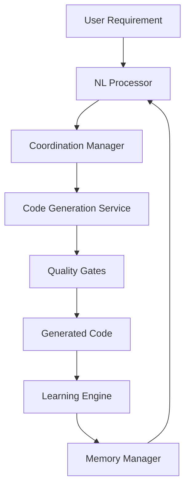

# AGI-like Coding Enhancement Roadmap

## Overview

This roadmap outlines the specific steps to transform Claude Code Zen into a full AGI-like coding system with advanced AGUI capabilities. The plan leverages existing strengths while addressing critical gaps identified in the research.

## Phase 1: Foundation (Months 1-3)
**Goal: Enable basic AGI-like coding capabilities**

### Month 1: LLM Integration Infrastructure

#### Week 1-2: LLM Provider Integration
- [ ] **Design LLM abstraction layer**
  ```typescript
  interface LLMProvider {
    generateCode(prompt: string, context: ProjectContext): Promise<GeneratedCode>;
    completeCode(partial: string, context: EditingContext): Promise<CodeCompletion>;
    explainCode(code: string): Promise<CodeExplanation>;
  }
  ```
- [ ] **Implement Anthropic Claude integration** (recommended)
- [ ] **Add OpenAI GPT-4 fallback option**
- [ ] **Create context management system** for large codebases
- [ ] **Design prompt engineering framework**

#### Week 3-4: Code Generation Service
- [ ] **Implement AGICodeGenerationService** (see implementation example)
- [ ] **Integrate with existing coordination system**
- [ ] **Add quality gates integration**
- [ ] **Create code validation pipeline**
- [ ] **Add error handling and retry logic**

### Month 2: AGUI Enhancement

#### Week 1-2: Natural Language Interface
- [ ] **Implement NaturalLanguageProcessor**
- [ ] **Enhance existing AGUI with NL capabilities**
- [ ] **Add conversational interface for requirements**
- [ ] **Create AI reasoning explanation system**
- [ ] **Integrate with TaskMaster approval gates**

#### Week 3-4: Enhanced User Experience
- [ ] **Add real-time code suggestions in dashboard**
- [ ] **Implement code explanation tooltips**
- [ ] **Create interactive code generation interface**
- [ ] **Add voice input support (basic)**
- [ ] **Enhance error messaging with AI assistance**

### Month 3: Learning Infrastructure

#### Week 1-2: Feedback Collection
- [ ] **Implement developer feedback collection system**
- [ ] **Add project outcome tracking**
- [ ] **Create code quality metrics collection**
- [ ] **Integrate with existing memory system**

#### Week 3-4: Basic Learning Pipeline
- [ ] **Implement SelfLearningEngine (basic version)**
- [ ] **Add pattern recognition system**
- [ ] **Create feedback analysis pipeline**
- [ ] **Integrate learning with code generation**

**Phase 1 Success Metrics:**
- ✅ Generate functional code from natural language (70% accuracy)
- ✅ Complete partial code implementations (80% accuracy)
- ✅ Explain code decisions to users
- ✅ Collect and process developer feedback

---

## Phase 2: Intelligence Enhancement (Months 4-6)
**Goal: Advanced AGI-like coding with learning capabilities**

### Month 4: Advanced Code Generation

#### Week 1-2: Multi-File Code Generation
- [ ] **Implement project-wide code generation**
- [ ] **Add cross-file dependency management**
- [ ] **Create architectural planning capabilities**
- [ ] **Implement code refactoring suggestions**

#### Week 3-4: Automated Testing Generation
- [ ] **Add test case generation from requirements**
- [ ] **Implement test completion for existing code**
- [ ] **Create integration test generation**
- [ ] **Add test quality assessment**

### Month 5: Creative Problem-Solving

#### Week 1-2: Algorithm Generation
- [ ] **Implement creative algorithm design**
- [ ] **Add optimization suggestion generation**
- [ ] **Create performance improvement recommendations**
- [ ] **Add architectural alternative generation**

#### Week 3-4: Innovation Tracking
- [ ] **Implement innovation measurement system**
- [ ] **Add novel solution detection**
- [ ] **Create creativity scoring algorithms**
- [ ] **Integrate with coordination system**

### Month 6: Advanced Learning

#### Week 1-2: Enhanced Learning Pipeline
- [ ] **Implement advanced pattern recognition**
- [ ] **Add cross-project learning capabilities**
- [ ] **Create adaptive prompt optimization**
- [ ] **Implement meta-learning algorithms**

#### Week 3-4: Continuous Improvement
- [ ] **Add automated model fine-tuning**
- [ ] **Implement performance optimization**
- [ ] **Create self-assessment capabilities**
- [ ] **Add capability gap detection**

**Phase 2 Success Metrics:**
- ✅ Plan and implement multi-file features (85% accuracy)
- ✅ Generate novel solutions to complex problems
- ✅ Learn and improve from feedback continuously
- ✅ Generate comprehensive test suites automatically

---

## Phase 3: Full AGI Capabilities (Months 7-12)
**Goal: Complete autonomous development with human oversight**

### Month 7-8: Autonomous Development

#### Requirements Analysis Automation
- [ ] **Implement automated requirement decomposition**
- [ ] **Add stakeholder need analysis**
- [ ] **Create acceptance criteria generation**
- [ ] **Implement requirement validation**

#### Architectural Decision Making
- [ ] **Add autonomous architectural planning**
- [ ] **Implement technology selection assistance**
- [ ] **Create design pattern recommendation**
- [ ] **Add scalability planning**

### Month 9-10: Visual Programming Interface

#### Drag-and-Drop Coding
- [ ] **Implement visual workflow designer**
- [ ] **Add component library management**
- [ ] **Create visual code generation**
- [ ] **Implement workflow-to-code conversion**

#### Multi-Modal Interaction
- [ ] **Add sketch-to-code capabilities**
- [ ] **Implement diagram understanding**
- [ ] **Create voice-controlled development**
- [ ] **Add gesture-based interaction**

### Month 11-12: Meta-Learning and Self-Improvement

#### Self-Modifying Capabilities
- [ ] **Implement meta-learning algorithms**
- [ ] **Add self-improvement loops**
- [ ] **Create capability evolution tracking**
- [ ] **Implement adaptive architecture**

#### Advanced Reasoning
- [ ] **Add causal reasoning capabilities**
- [ ] **Implement analogical problem-solving**
- [ ] **Create domain transfer learning**
- [ ] **Add emergence detection**

**Phase 3 Success Metrics:**
- ✅ Complete features with minimal human input (95% success rate)
- ✅ Make architectural decisions autonomously (with approval)
- ✅ Self-improve based on development outcomes
- ✅ Generate truly novel solutions to unprecedented problems

---

## Implementation Strategy

### Technical Architecture

#### Integration Points
```typescript
// Core integration with existing systems
interface AGIIntegration {
  coordinationManager: CoordinationManager;     // Existing
  memoryManager: MemoryManager;                 // Existing  
  qualityGates: QualityGateManager;            // Existing
  codeGenerationService: CodeGenerationService; // New
  nlProcessor: NaturalLanguageProcessor;        // New
  learningEngine: SelfLearningEngine;          // New
}
```

#### Data Flow Enhancement


### Resource Requirements

#### Development Team
- **AI/ML Engineers** (2-3): LLM integration, learning systems
- **Frontend Developers** (2): AGUI enhancement, visual programming
- **Backend Developers** (2): Integration, coordination enhancement
- **DevOps Engineers** (1): Deployment, monitoring, optimization
- **UX/UI Designers** (1): AGUI design, user experience

#### Infrastructure
- **GPU Resources**: For local LLM inference (optional)
- **API Credits**: For cloud LLM services (Anthropic, OpenAI)
- **Storage Enhancement**: For expanded learning data
- **Monitoring Systems**: For AGI capability tracking

#### Budget Estimate
- **Development**: $500K - $750K over 12 months
- **Infrastructure**: $50K - $100K annually
- **LLM API Costs**: $20K - $50K annually
- **Total**: $570K - $900K for full implementation

### Risk Management

#### Technical Risks
- **LLM Integration Complexity**: Mitigate with phased approach
- **Performance Degradation**: Monitor and optimize continuously
- **Quality Regression**: Maintain existing quality gates
- **Security Vulnerabilities**: Regular security audits

#### Business Risks  
- **User Adoption**: Focus on gradual capability introduction
- **Competition**: Leverage existing architectural advantages
- **Market Changes**: Maintain flexibility in implementation
- **Resource Constraints**: Prioritize highest-impact features

### Success Monitoring

#### Key Performance Indicators
- **Code Generation Accuracy**: Target >90% compilable code
- **Development Speed**: Target 3-5x improvement
- **User Satisfaction**: Target >4.5/5 rating
- **System Reliability**: Target 99.9% uptime
- **Learning Effectiveness**: Demonstrable improvement over time

#### Monitoring Dashboard
```typescript
interface AGIMetrics {
  codeGenerationAccuracy: number;
  developmentSpeedImprovement: number;
  userSatisfactionScore: number;
  systemReliability: number;
  learningEffectiveness: number;
  creativityScore: number;
  autonomyLevel: number;
}
```

---

## Competitive Positioning

### Unique Value Proposition
**"The only enterprise AGI coding platform with advanced multi-agent coordination, sophisticated AGUI, and enterprise-grade governance."**

### Competitive Advantages
1. **Multi-Agent Coordination**: Unmatched in the industry
2. **Enterprise Architecture**: Production-ready from day one
3. **Advanced AGUI**: Superior human-AI collaboration
4. **Learning System**: Continuous improvement capability
5. **Compliance Ready**: SOC2 and enterprise governance

### Market Strategy
- **Target Enterprise Customers**: Large organizations needing coordination
- **Partner with System Integrators**: Leverage existing relationships
- **Focus on Compliance Markets**: Financial, healthcare, government
- **Build Developer Ecosystem**: Community around AGI coordination

---

## Conclusion

This roadmap transforms Claude Code Zen from an advanced coordination platform into a full AGI-like coding system while preserving and leveraging its unique architectural advantages.

### Key Success Factors
1. **Leverage Existing Strengths**: Multi-agent coordination, AGUI, enterprise features
2. **Integrate Best-in-Class LLMs**: Don't reinvent, integrate intelligently
3. **Maintain Quality Standards**: Use existing quality gates and compliance
4. **Focus on Enterprise Needs**: Coordination, governance, human oversight
5. **Build Learning Systems**: Continuous improvement and adaptation

### Timeline Summary
- **Month 3**: Basic AGI-like coding capabilities
- **Month 6**: Advanced coding with learning
- **Month 12**: Full AGI-like autonomous development

### Investment Return
- **Development Cost**: $570K - $900K
- **Market Opportunity**: Multi-billion dollar AGI coding market
- **Competitive Position**: First enterprise AGI coding platform
- **ROI Timeline**: 18-24 months to market leadership

**The foundation exists. The plan is clear. The opportunity is significant.**

---

*Roadmap created: August 30, 2024*  
*Scope: Full AGI-like coding transformation*  
*Timeline: 12-month implementation plan*