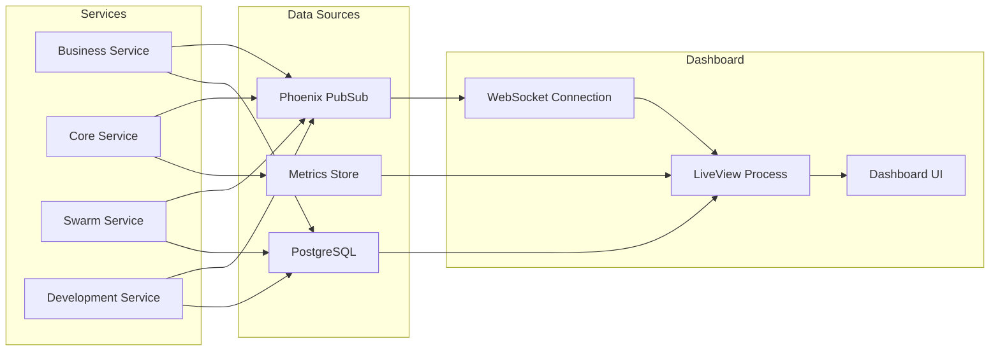

# Visionary Software Intelligence Unified Monitoring Dashboard Design

## Dashboard Overview

The Visionary Software Intelligence monitoring dashboard provides real-time visibility into the entire workflow from code analysis to intelligent refactoring recommendations. Built with Phoenix LiveView for reactive, real-time updates without page refreshes.

## Dashboard Layout Wireframe

```
┌─────────────────────────────────────────────────────────────────────────────┐
│                   Visionary Software Intelligence Dashboard                   │
├─────────────────────────────────────────────────────────────────────────────┤
│  🏢 Strategic Planning          │  🐝 Swarm Coordination                      │
│  ┌────────────────────────┐    │  ┌────────────────────────────────────┐   │
│  │ Active Visions: 12     │    │  │ Queen Status: ACTIVE               │   │
│  │ Approved: 8            │    │  │ Active Agents: 42                  │   │
│  │ In Review: 3           │    │  │ MRAP Sessions: 5                   │   │
│  │ Pending: 1             │    │  │ Coordination Efficiency: 87%       │   │
│  └────────────────────────┘    │  └────────────────────────────────────┘   │
│                                 │                                             │
│  Vision Cards:                  │  Agent Activity:                          │
│  ┌────────────────────────┐    │  ┌────────────────────────────────────┐   │
│  │ V-2024-001             │    │  │ 🟢 vision_analyst: Analyzing...    │   │
│  │ Status: In Progress    │    │  │ 🟢 roadmap_architect: Planning... │   │
│  │ Progress: 65%          │    │  │ 🟢 technical_lead: Designing...   │   │
│  │ ROI: $2.3M             │    │  │ 🟡 qa_specialist: Waiting...      │   │
│  └────────────────────────┘    │  │ 🟢 deployment_coord: Active...    │   │
│                                 │  └────────────────────────────────────┘   │
├─────────────────────────────────┴───────────────────────────────────────────┤
│  💻 Technical Execution         │  📊 System Performance                     │
│  ┌────────────────────────┐    │  ┌────────────────────────────────────┐   │
│  │ Active Squads: 8       │    │  │ Service Health:                    │   │
│  │ Tasks Completed: 234   │    │  │ ✅ Business Service: 100%         │   │
│  │ Code Generated: 45.2K  │    │  │ ✅ Core Service: 100%             │   │
│  │ Tests Passing: 98.3%   │    │  │ ✅ Swarm Service: 99.8%           │   │
│  └────────────────────────┘    │  │ ✅ Development Service: 100%      │   │
│                                 │  └────────────────────────────────────┘   │
│  Implementation Progress:       │                                             │
│  ┌────────────────────────┐    │  Performance Metrics:                     │
│  │ ██████████████░░░ 75% │    │  ┌────────────────────────────────────┐   │
│  │ API Development       │    │  │ API Response: 45ms avg            │   │
│  │ ████████████████ 100% │    │  │ Workflow Completion: 96%          │   │
│  │ Testing               │    │  │ AI Consensus Rate: 89%            │   │
│  │ ██████░░░░░░░░░░ 40% │    │  │ Token Usage: 2.3M/5M              │   │
│  │ Deployment            │    │  └────────────────────────────────────┘   │
│  └────────────────────────┘    │                                             │
└─────────────────────────────────────────────────────────────────────────────┘
```

## Component Architecture

### 1. Strategic Planning View (Business Service)
- **Vision Cards**: Display active visions with status, progress, and ROI
- **Portfolio Status**: Overall portfolio health and metrics
- **Approval Queue**: Pending approvals with stakeholder information
- **Timeline View**: Gantt-style view of vision roadmaps

### 2. Swarm Coordination View (Swarm Service)
- **Queen Status**: Central coordinator health and activity
- **Agent Activity**: Real-time status of all spawned agents
- **MRAP Reasoning**: Active multi-agent reasoning sessions
- **Coordination Graph**: Visual topology of agent connections

### 3. Technical Execution View (Development Service)
- **Squad Status**: Active development squads and their tasks
- **Implementation Progress**: Task completion by category
- **Code Metrics**: Lines generated, tests written, coverage
- **Deployment Pipeline**: CI/CD status and artifacts

### 4. System Performance View (Core Service)
- **Service Health**: Real-time health status of all services
- **Performance Metrics**: API latency, throughput, error rates
- **AI Usage**: Token consumption, model performance
- **Resource Utilization**: CPU, memory, network metrics

## Data Flow Architecture



## LiveView Components

### 1. Main Dashboard LiveView
```elixir
defmodule VisionToCodeWeb.DashboardLive do
  use Phoenix.LiveView
  
  @impl true
  def mount(_params, _session, socket) do
    if connected?(socket) do
      # Subscribe to all service events
      Phoenix.PubSub.subscribe(VisionToCode.PubSub, "vision:*")
      Phoenix.PubSub.subscribe(VisionToCode.PubSub, "swarm:*")
      Phoenix.PubSub.subscribe(VisionToCode.PubSub, "technical:*")
      Phoenix.PubSub.subscribe(VisionToCode.PubSub, "metrics:*")
      
      # Start periodic metric updates
      :timer.send_interval(1000, self(), :update_metrics)
    end
    
    {:ok, assign(socket, initial_state())}
  end
end
```

### 2. Vision Status Component
```elixir
defmodule VisionToCodeWeb.Components.VisionStatus do
  use Phoenix.LiveComponent
  
  def render(assigns) do
    ~H"""
    <div class="vision-status-card">
      <h3><%= @vision.id %></h3>
      <div class="status <%= status_class(@vision.status) %>">
        <%= @vision.status %>
      </div>
      <div class="progress-bar">
        <div class="progress" style={"width: #{@vision.progress}%"}></div>
      </div>
      <div class="metrics">
        <span>ROI: <%= format_currency(@vision.roi) %></span>
        <span>ETA: <%= format_date(@vision.eta) %></span>
      </div>
    </div>
    """
  end
end
```

### 3. Agent Activity Monitor
```elixir
defmodule VisionToCodeWeb.Components.AgentMonitor do
  use Phoenix.LiveComponent
  
  def render(assigns) do
    ~H"""
    <div class="agent-monitor">
      <div :for={agent <- @agents} class="agent-status">
        <span class={"status-indicator #{agent_status_class(agent)}"}>●</span>
        <span class="agent-type"><%= agent.type %></span>
        <span class="agent-task"><%= agent.current_task %></span>
      </div>
    </div>
    """
  end
end
```

### 4. Performance Metrics Chart
```elixir
defmodule VisionToCodeWeb.Components.MetricsChart do
  use Phoenix.LiveComponent
  
  def render(assigns) do
    ~H"""
    <div class="metrics-chart" phx-hook="MetricsChart" id="metrics-chart">
      <canvas id="performance-canvas"></canvas>
    </div>
    """
  end
end
```

## Real-time Updates

### Event Handlers
1. **Vision Events**
   - vision:created
   - vision:approved
   - vision:progress_update
   - vision:completed

2. **Swarm Events**
   - swarm:agent_spawned
   - swarm:agent_status_change
   - swarm:coordination_update
   - swarm:mrap_result

3. **Technical Events**
   - technical:task_started
   - technical:task_completed
   - technical:code_generated
   - technical:test_results

4. **Metric Events**
   - metrics:service_health
   - metrics:performance_update
   - metrics:ai_usage
   - metrics:resource_utilization

## Interactive Features

### 1. Drill-down Views
- Click on vision card → Detailed vision view with full timeline
- Click on agent → Agent history and task log
- Click on squad → Squad member details and task assignments
- Click on service health → Detailed service metrics and logs

### 2. Control Actions
- Approve/Reject visions (with proper auth)
- Spawn additional agents for bottlenecks
- Adjust coordination parameters
- Trigger manual health checks

### 3. Filtering and Search
- Filter by vision status, date range, ROI
- Search agents by type or task
- Filter metrics by time window
- Export data for reporting

## Styling and UX

### Color Scheme
- **Primary**: #5B21B6 (Purple - Singularity brand)
- **Success**: #10B981 (Green - healthy/active)
- **Warning**: #F59E0B (Amber - pending/waiting)
- **Danger**: #EF4444 (Red - errors/blocked)
- **Background**: #111827 (Dark gray)
- **Surface**: #1F2937 (Lighter gray)

### Responsive Design
- Desktop: 4-column grid layout
- Tablet: 2-column layout with stacked sections
- Mobile: Single column with collapsible sections

### Accessibility
- ARIA labels for all interactive elements
- Keyboard navigation support
- Screen reader friendly status updates
- High contrast mode support

## Performance Considerations

### 1. Data Optimization
- Aggregate metrics server-side before sending
- Use ETS for caching frequently accessed data
- Implement pagination for large datasets
- Debounce rapid updates

### 2. LiveView Optimization
- Use temporary assigns for large lists
- Implement virtual scrolling for agent lists
- Batch DOM updates
- Use phx-update="prepend" for logs

### 3. WebSocket Management
- Implement reconnection logic
- Show connection status indicator
- Queue updates during disconnection
- Graceful degradation

## Security Considerations

### 1. Authentication
- Require login for dashboard access
- Role-based access control (RBAC)
- Service-to-service auth for API calls

### 2. Authorization
- View-only access for most users
- Admin access for control actions
- Audit logging for all actions

### 3. Data Protection
- No sensitive data in WebSocket messages
- Encrypt data at rest and in transit
- Implement rate limiting

## Implementation Timeline

### Phase 1: Core Dashboard (Day 18)
- [ ] Create LiveView module structure
- [ ] Implement basic layout and routing
- [ ] Set up WebSocket connections
- [ ] Create initial component shells

### Phase 2: Data Integration (Day 19 Morning)
- [ ] Connect to service APIs
- [ ] Implement PubSub subscriptions
- [ ] Create data aggregation logic
- [ ] Add real-time update handlers

### Phase 3: Interactive Features (Day 19 Afternoon)
- [ ] Add drill-down views
- [ ] Implement control actions
- [ ] Create filtering/search
- [ ] Add export functionality

### Phase 4: Polish & Testing (Day 19 Evening)
- [ ] Apply styling and animations
- [ ] Test real-time updates
- [ ] Optimize performance
- [ ] Document usage

This design provides a comprehensive, real-time monitoring solution for the Vision-to-Code system, enabling stakeholders to track progress from strategic vision through to deployed code.