# File-Aware Core

A Rust crate for intelligent code generation and analysis, integrated with enterprise methodologies and AI-driven quality assurance.

## Overview

`file-aware-core` is a core component of the Claude Code Zen platform, providing advanced code analysis, generation, and quality assurance capabilities. It integrates with various domains such as knowledge systems, memory management, database operations, and enterprise methodologies like SPARC and SAFe.

## Core Capabilities

- **Smart Code Generation**: Generates production-ready code with integrated linting and quality gates.
- **Oxlint Integration**: Ensures code quality through strict linting rules.
- **Dependency Safety**: Analyzes and manages dependencies to prevent conflicts.
- **AI-Driven Analysis**: Uses machine learning to detect common AI coding mistakes and improve code quality.
- **Database Integration**: Connects with the TypeScript database layer for persistent storage.
- **SPARC Methodology**: Implements the 5-phase SPARC methodology for structured development.
- **SAFe PI Planning**: Supports user story level integration with SAFe program increment planning.

## System Architecture

Below is a diagram illustrating the connections between various components in the `file-aware-core` system, with an emphasis on event-driven architecture:

// TODO: Extend Mermaid to include TaskMaster approvals and ML analysis node.

```mermaid
flowchart TD
    %% Core Components
    FAC[File-Aware-Core] -->|Generates Code| CG[Code Generation]
    FAC -->|Analyzes Code| CA[Code Analysis]
    FAC -->|Enforces Quality| QG[Quality Gates]
    FAC -->|Uses ML| ML[ML Analysis]

    %% Knowledge and Memory Integration
    FAC -->|Queries Knowledge| KI[Knowledge Integration]
    KI -->|RAG Semantic Search| RAG[RAG System]
    KI -->|FACT Verified Data| FACT[FACT System]
    KI -->|Brain Coordination| BI[Brain Integration]
    BI -->|Optimizes Prompts| DSPY[DSPy]

    FAC -->|Manages Storage| MI[Memory Integration]
    MI -->|Fast Cache| CB[Cache Backend]
    MI -->|Persistent Sessions| SB[Session Backend]
    MI -->|Vector Search| SemB[Semantic Backend]
    MI -->|Debug Storage| DB[Debug Backend]

    %% Database Integration
    FAC -->|Persists Data| DM[Database Manager]
    DM -->|Executes Scripts| TS[TypeScript Layer]
    TS -->|Accesses| DBs[(Database Package)]
    DBs -->|Stores| SQLite[(SQLite)]
    DBs -->|Stores| LanceDB[(LanceDB)]
    DBs -->|Stores| Kuzu[(Kuzu)]

    %% Enterprise Methodologies
    FAC -->|Implements Methodologies| SPARC[SPARC Integration]
    SPARC -->|Follows Phases| SP[SPARC Phases]
    SPARC -->|Ensures Quality| SQG[SPARC Quality Gates]
    SPARC -->|Uses ML| ML

    FAC -->|Plans User Stories| SAFE[SAFE Integration]
    SAFE -->|PI Planning| PIP[PI Planning]
    SAFE -->|Tracks Progress| USP[User Story Progress]
    SAFE -->|Analyzes Complexity| SCA[Story Complexity Analysis]
    SAFE -->|Requests Approval| TM[TaskMaster]
    SAFE -->|Uses ML| ML

    %% Event-Driven Architecture
    FAC -->|Communicates via| EB[Event Bus]
    EB -->|Publishes Events| EV[Events]
    EV -->|Triggers| KR[Knowledge Responses]
    EV -->|Triggers| MR[Memory Updates]
    EV -->|Triggers| DBU[Database Updates]
    EV -->|Triggers| SPu[SPARC Updates]
    EV -->|Triggers| SAFEu[SAFE Updates]

    %% Connections Between Domains
    KI -->|Stores Results| MI
    MI -->|Provides Data| KI
    BI -->|Coordinates| EB
    SPARC -->|Notifies Progress| EB
    SAFE -->|Notifies Status| EB
    DM -->|Syncs Data| MI
    ML -->|Informs| SPARC
    ML -->|Informs| SAFE
    TM -->|Approves Changes| SAFE
    DSPY -->|Enhances| BI

    %% Styling
    style FAC fill:#f9a825,stroke:#333,stroke-width:2px
    style EB fill:#43cea2,stroke:#333,stroke-width:2px
    style KI fill:#ff7e5f,stroke:#333
    style MI fill:#6f42c1,stroke:#333
    style DM fill:#2196f3,stroke:#333
    style SPARC fill:#00b09b,stroke:#333
    style SAFE fill:#24c1e0,stroke:#333
    style ML fill:#ff4757,stroke:#333
    style TM fill:#ffc409,stroke:#333
    style DSPY fill:#1e90ff,stroke:#333
```



## Key Features

- **Quality Assurance**: Implements a two-tier linting system with `oxlint` and `eslint`.
- **Machine Learning**: Integrates ML capabilities for code analysis and mistake detection.
- **Database Operations**: Bridges Rust and TypeScript for database interactions.
- **Enterprise Integration**: Supports SPARC and SAFe methodologies for structured development.
- **Event-Driven**: Utilizes an event bus for communication across all components.

## Usage

```rust
use file_aware_core::{FileAwareCore, FileAwareConfig, FileAwareRequest};

async fn example() {
    let config = FileAwareConfig::default();
    let core = FileAwareCore::new(config).unwrap();
    
    let request = FileAwareRequest {
        operation: "analyze".to_string(),
        file_path: Some("path/to/file.rs".to_string()),
        content: None,
        language: Some("rust".to_string()),
        context: None,
        options: std::collections::HashMap::new(),
    };
    
    let response = core.process_request(request).await.unwrap();
    println!("Analysis result: {:?}", response.data);
}
```

## Output Quality

- **Linting**: Ensures code passes strict quality gates before acceptance.
- **AI Analysis**: Detects common AI-generated code mistakes.
- **Methodology Adherence**: Enforces enterprise development practices.
- **Event Notifications**: Publishes events for system-wide coordination.

## Configuration

The crate can be configured via environment variables or a configuration file:

- `QUALITY_GATE_STRICT`: Enable strict mode for quality gates.
- `ENABLE_OXLINT`: Toggle for oxlint integration.
- `ENABLE_ESLINT`: Toggle for eslint integration.
- `MEMORY_CACHE_ENABLED`: Toggle for memory cache backend.
- `KNOWLEDGE_RAG_ENABLED`: Toggle for RAG knowledge system.
- `EVENT_BUS_ENABLED`: Toggle for event bus integration.

## Use Cases

- **Code Generation**: Generate production-ready code with quality assurance.
- **Code Review**: Analyze existing code for quality and adherence to standards.
- **Enterprise Development**: Implement code within SPARC and SAFe frameworks.
- **Knowledge Management**: Query and store knowledge for code intelligence.

## Performance

- **Speed**: Optimized for rapid code analysis and generation.
- **Memory**: Efficient memory backend management.
- **Scalability**: Designed to handle large codebases with event-driven scalability.

## Security

- **Dependency Safety**: Prevents conflicts and ensures safe dependency usage.
- **Data Persistence**: Secure storage options with database integration.
- **Event Security**: Ensures secure communication via event bus.
