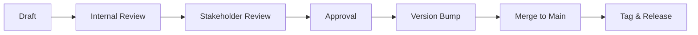

# Document Versioning Strategy

This document outlines how versioning works for our document-driven development system.

## Overview

All documents in the workflow (Vision → ADRs → PRDs → Epics → Features → Tasks → Specs) follow semantic versioning principles adapted for documentation.

## Version Format

### Document Version: `MAJOR.MINOR.PATCH`

- **MAJOR**: Fundamental changes that affect dependent documents
- **MINOR**: Significant updates that add new sections or requirements  
- **PATCH**: Minor corrections, clarifications, or formatting changes

### Example Progression
- `1.0.0` - Initial approved version
- `1.0.1` - Fixed typos and minor clarifications
- `1.1.0` - Added new requirements or sections
- `2.0.0` - Major restructure affecting implementation

## Version Metadata

Each document includes version metadata in the header:

```markdown
# [Document Title]

**Document Type**: [Type]  
**Version**: 2.1.0  
**Created**: 2024-01-15  
**Last Updated**: 2024-03-20  
**Status**: [Draft | Review | Approved | Active | Deprecated]
```

## Versioning Rules by Document Type

### 01-Vision (Strategic Documents)
- **MAJOR**: Change in strategic direction or goals
- **MINOR**: New strategic objectives or target markets
- **PATCH**: Clarifications or minor updates

### 02-ADRs (Architecture Decision Records)
- **MAJOR**: Reversal or significant change to architectural decision
- **MINOR**: Updates to implementation approach
- **PATCH**: Clarifications or additional context

### 03-PRDs (Product Requirements)
- **MAJOR**: Change in core requirements or success metrics
- **MINOR**: New features or significant requirement changes
- **PATCH**: Clarifications or minor requirement adjustments

### 04-Epics (Feature Sets)
- **MAJOR**: Change in epic scope or core user stories
- **MINOR**: New user stories or significant feature changes
- **PATCH**: Story refinements or acceptance criteria updates

### 05-Features (Individual Features)
- **MAJOR**: Change in core functionality or user experience
- **MINOR**: New acceptance criteria or significant changes
- **PATCH**: Clarifications or minor criteria updates

### 06-Tasks (Implementation Tasks)
- **MAJOR**: Change in implementation approach or scope
- **MINOR**: New acceptance criteria or technical requirements
- **PATCH**: Clarifications or minor updates

### 07-Specs (Technical Specifications)
- **MAJOR**: Breaking API changes or architecture changes
- **MINOR**: New endpoints, features, or non-breaking changes
- **PATCH**: Bug fixes, clarifications, or documentation updates

## Dependency Versioning

### Upstream Dependencies
When a document changes, consider impact on dependent documents:

```
Vision 2.0.0 → triggers review of ADRs and PRDs
ADR 1.5.0 → may trigger PRD updates
PRD 3.2.0 → triggers Epic and Feature reviews
```

### Version Compatibility Matrix
Document templates include dependency tracking:

```markdown
### Dependencies
- **Vision v2.1.0**: Strategic alignment requirements
- **ADR-001 v1.3.0**: Architecture decisions implemented
- **PRD-Payments v1.0.0**: Payment system requirements
```

## Git Integration

### Branch Strategy
- `main` - Approved document versions
- `draft/[document-name]` - Work in progress
- `review/[document-name]` - Under review
- `archive/[document-name]` - Deprecated versions

### Commit Messages
```
docs(vision): bump to v2.1.0 - add AI strategy focus

- Added AI/ML strategic initiatives
- Updated success metrics for Q2
- Clarified target market expansion
```

### Tags
- `vision-v2.1.0` - Document version tags
- `release-2024-q1` - Release milestone tags
- `prd-payments-v1.0.0` - Feature-specific version tags

## Change Management Process

### 1. Version Impact Assessment
Before making changes, assess impact:
- **Downstream Impact**: What documents depend on this?
- **Implementation Impact**: Does this affect active development?
- **Stakeholder Impact**: Who needs to approve major changes?

### 2. Change Categories

#### PATCH Changes (0.0.X)
- **Process**: Direct edit with version bump
- **Approval**: Document owner approval
- **Notification**: Update changelog

#### MINOR Changes (0.X.0)  
- **Process**: Draft → Review → Approval → Merge
- **Approval**: Stakeholder review required
- **Notification**: Notify dependent document owners

#### MAJOR Changes (X.0.0)
- **Process**: RFC → Draft → Extensive Review → Approval
- **Approval**: All stakeholders and dependent teams
- **Notification**: Organization-wide communication

### 3. Review Process


## Automation

### Pre-commit Hooks
```bash
# Check version bump
- id: version-check
  name: Verify version bump in document header
  entry: scripts/check-version-bump.sh
  language: script
  files: 'docs/.*\.md$'

# Lint documents
- id: markdownlint
  name: Lint markdown documents
  entry: markdownlint
  language: node
  files: 'docs/.*\.md$'
```

### GitHub Actions
```yaml
name: Document Quality Check

on:
  pull_request:
    paths: ['docs/**/*.md']

jobs:
  version-check:
    runs-on: ubuntu-latest
    steps:
      - uses: actions/checkout@v3
      - name: Check version consistency
        run: scripts/validate-document-versions.sh
      
  lint-docs:
    runs-on: ubuntu-latest  
    steps:
      - uses: actions/checkout@v3
      - name: Lint documents
        run: markdownlint docs/
```

## Changelog Management

### Document Changelog Format
Each document maintains its own changelog:

```markdown
## Changelog

### [2.1.0] - 2024-03-20
#### Added
- New AI strategy focus area
- Machine learning success metrics

#### Changed  
- Updated target market definition
- Revised timeline for Q2 objectives

#### Removed
- Deprecated mobile-first strategy

### [2.0.1] - 2024-03-15
#### Fixed
- Corrected market sizing data
- Fixed broken links to research
```

### Global Changelog
Project maintains master changelog:

```markdown
# Project Documentation Changelog

## 2024-03-20
- **Vision v2.1.0**: Added AI strategic focus
- **ADR-005 v1.2.0**: Updated microservices architecture
- **PRD-Analytics v1.0.0**: Initial analytics product requirements

## 2024-03-15
- **Epic-UserAuth v1.1.0**: Added social login requirements
- **Feature-OAuth v1.0.1**: Clarified security requirements
```

## Deprecation Strategy

### Deprecation Process
1. **Mark as Deprecated**: Update status in document header
2. **Migration Path**: Document how to migrate to new version
3. **Grace Period**: Allow time for dependent systems to update
4. **Archival**: Move to archive folder with final version tag

### Archive Structure
```
docs/
├── archive/
│   ├── 2023/
│   │   ├── vision-v1.0.0.md
│   │   └── prd-legacy-auth-v2.1.0.md
│   └── 2024-q1/
└── current/
    ├── 01-vision/
    ├── 02-adrs/
    └── ...
```

## Tools & Scripts

### Version Management CLI
```bash
# Bump document version
claude-zen version bump docs/01-vision/product-vision.md minor

# Check version consistency
claude-zen version check docs/

# Generate version report
claude-zen version report --format=json
```

### Version Validation
- Schema validation for document headers
- Dependency version compatibility checks
- Breaking change detection
- Automated changelog generation

## Best Practices

### 1. Semantic Meaning
- Version numbers should reflect actual semantic changes
- Use PATCH for fixes, MINOR for additions, MAJOR for breaking changes
- Consider downstream impact when choosing version level

### 2. Documentation Quality
- Always update "Last Updated" date with version changes
- Maintain clear changelogs
- Document migration paths for major changes

### 3. Communication
- Notify stakeholders of MINOR and MAJOR changes
- Use clear commit messages with version impacts
- Tag releases appropriately for tracking

### 4. Consistency
- Follow the same versioning rules across all document types
- Use automated tools to enforce consistency
- Regular audits of version compliance

This versioning strategy ensures that our document-driven development system maintains quality, traceability, and clear evolution paths for all stakeholders.